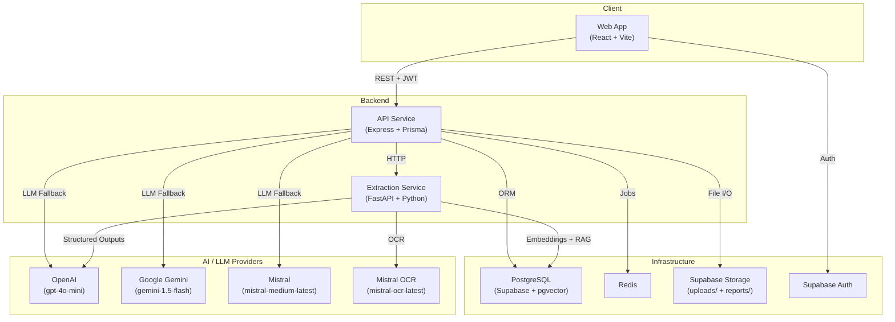
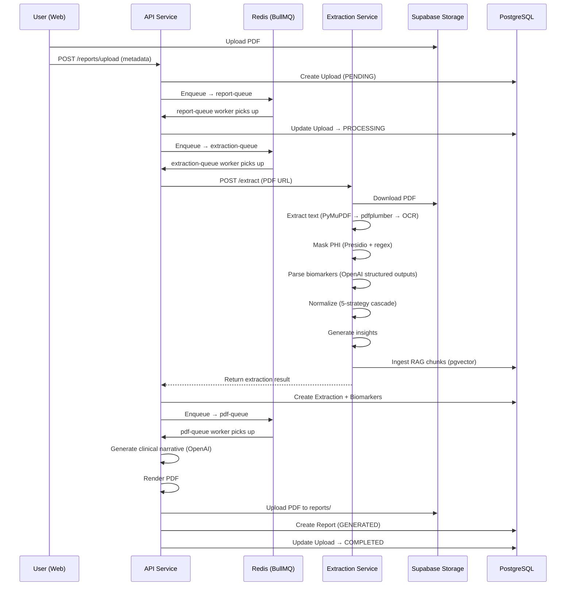

# 00 — Project Overview

## Purpose

This document is the entry point for all technical documentation of **HealthLab** (internal monorepo name: `healthlab-monorepo`). It describes what the platform does, how it is structured, what technologies it uses, why key architectural decisions were made, and where each concern lives in the codebase.

Any developer joining this project should read this document first.

---

## Overview

HealthLab is a multi-tenant, AI-powered SaaS platform for medical blood report analysis. Clinicians and patients upload lab report PDFs. The system extracts biomarker data, masks protected health information (PHI), normalizes values against a canonical dictionary, classifies abnormalities, generates AI-driven clinical insights, and produces branded PDF reports — all through an automated, queue-driven pipeline.

A RAG (Retrieval-Augmented Generation) chat assistant allows patients and clinicians to ask clinical questions grounded in the patient's longitudinal health data.

The platform serves two user personas:

| Persona    | Role                                                                                   |
| ---------- | -------------------------------------------------------------------------------------- |
| **Patient**    | Uploads personal lab reports, views biomarker trends, receives AI health insights, chats with the assistant. |
| **Clinician**  | Manages a patient directory, reviews reports, compares results, tracks appointments and tasks, accesses clinical-grade AI recommendations. |

---

## Architecture

### High-Level System Diagram



### Monorepo Structure

```
healthlab-monorepo/
├── apps/
│   ├── web/              # React 19 + Vite frontend
│   ├── api/              # Express + Prisma backend (Node/TypeScript)
│   └── extraction/       # FastAPI extraction & RAG service (Python 3.12)
├── packages/
│   ├── shared/           # Shared TypeScript types and utilities
│   └── phi-masks/        # PHI masking patterns (shared config)
├── infra/
│   ├── Dockerfiles/
│   └── nginx/
├── docker-compose.yml
├── turbo.json            # Turborepo task runner config
└── pnpm-workspace.yaml   # pnpm workspace definition
```

**Build orchestration:** pnpm workspaces + Turborepo.

**Containerization:** Each service has its own `Dockerfile`. `docker-compose.yml` defines the full stack (Redis, Extraction, API, Web).

---

## Responsibilities

### Service Responsibility Matrix

| Service        | Language   | Responsibilities                                                                                  |
| -------------- | ---------- | ------------------------------------------------------------------------------------------------- |
| **`apps/web`**       | TypeScript | UI rendering, auth flows, report visualization, PDF export (client-side), chat interface, theming. |
| **`apps/api`**       | TypeScript | REST API, auth/authz, CRUD, background job orchestration, server-side PDF generation, LLM chat fallback. |
| **`apps/extraction`**| Python     | PDF text extraction, PHI detection/masking, LLM biomarker parsing, normalization, insight generation, RAG ingestion/retrieval. |

### Boundary Rules

- The **API** never directly parses PDFs or calls OCR. It delegates to the Extraction service via HTTP.
- The **Extraction service** never touches the database via Prisma. It reads/writes only to pgvector tables (`document_chunks`, `knowledge_base_chunks`) via raw SQL and returns structured JSON to the API.
- The **Web app** never calls the Extraction service directly. All communication goes through the API.
- **Supabase** owns authentication tokens, file storage, and the PostgreSQL database. The API validates JWTs issued by Supabase.

---

## Data Flow

### Core Processing Pipeline



### Pipeline Summary

| Stage | Queue | Concurrency | Retries | Backoff |
| ----- | ----- | ----------- | ------- | ------- |
| Upload intake | `report-queue` | 5 | 3 | Exponential |
| Extraction | `extraction-queue` | 5 | 3 | Exponential |
| PDF generation | `pdf-queue` | — | — | — |

### Chat / RAG Data Flow

1. User sends a message via `POST /chat`.
2. API attempts the Python RAG service first (`POST /rag/chat`).
3. RAG retrieves patient-scoped document chunks via cosine similarity over pgvector.
4. If RAG fails, API falls through: **Gemini → OpenAI → Mistral**.
5. System prompts differ by account type: patient receives plain-language responses; clinician receives clinical/peer-level detail.

---

## Components

### `apps/web` — Frontend

| Module | Path | Purpose |
| ------ | ---- | ------- |
| Auth | `contexts/AuthContext.tsx` | Dual-endpoint auth resolution (staff ↔ patient), session persistence. |
| Branding | `contexts/BrandingContext.tsx` | Multi-tenant theme/color injection from org branding config. |
| Onboarding | `contexts/OnboardingContext.tsx` | First-visit guided tour state (Driver.js). |
| Theme | `contexts/ThemeContext.tsx` | Light / dark / system mode toggle. |
| Report Dashboard | `components/dashboard/ReportDashboard.tsx` | Biomarker grid, reference-range sliders, flagged filtering, health score. |
| AI Chat | `components/dashboard/AIChat.tsx` | Multi-turn assistant with session management, markdown rendering, source citations. |
| Trend Analysis | `components/dashboard/TrendAnalysisChart.tsx` | Recharts time-series with reference-range shading. |
| Comparison | `components/dashboard/ComparisonView.tsx` | Side-by-side delta table (improved / worsened / stable / new / resolved). |
| PDF Export | `components/PremiumPDFDocument.tsx` | Client-side branded PDF via `@react-pdf/renderer`. |
| Clinician Dashboard | `components/dashboard/ClinicianDashboard.tsx` | Patient directory, activity feed, onboarding, appointments, tasks. |
| Patient Home | `components/dashboard/PatientHome.tsx` | Profile, health stats, health score, AI insights, report history. |

### `apps/api` — Backend

| Module | Path | Purpose |
| ------ | ---- | ------- |
| Routes | `src/routes/` | Express routers for auth, patients, reports, chat, appointments, tasks, branding. |
| Controllers | `src/controllers/` | Request handlers with Zod validation. |
| Services | `src/services/` | Business logic layer. |
| Queues | `src/queues/` | BullMQ workers: `report.queue.ts`, `extraction.queue.ts`, `pdf.queue.ts`. |
| AI | `src/ai/` | Multi-provider LLM client (Gemini, OpenAI, Mistral) with fallback chain. |
| Auth | `src/auth/` | Passport JWT strategy, guards (`requireAuth`, `requireAccountType`, `requireRole`). |
| PDF | `src/pdf/` | Server-side PDF rendering for the pdf-queue worker. |
| Storage | `src/storage/` | Supabase Storage client (bucket management, upload/download/delete). |

### `apps/extraction` — Extraction Service

| Module | Path | Purpose |
| ------ | ---- | ------- |
| Extractors | `app/extractors/` | `pymupdf.py`, `pdfplumber.py`, `mistral_ocr.py` — cascading text extraction. |
| Parsers | `app/parsers/` | LLM-based biomarker parsing, canonical dictionary, normalizer, fuzzy matching, quality scoring, insight generation. |
| PHI | `app/phi/` | `presidio.py` (NER-based), `regex_fallback.py` (pattern-based), `tokenizer.py` (deterministic token vault). |
| RAG | `app/rag/` | `ingestion.py` (chunk + embed), `retrieval.py` (cosine search + prompt assembly), `llm.py` (LangChain chat), `config.py`, `router.py`. |
| Routers | `app/routers/` | FastAPI endpoint definitions. |
| Models | `app/models/` | Pydantic v2 request/response schemas. |

### Database (Prisma Schema)

| Model | Purpose |
| ----- | ------- |
| `Organization` | Multi-tenant root. All data scoped by org. Plans: FREE, PRO, ENTERPRISE. |
| `OrganizationBranding` | Per-org color palette, logos, PDF theme, feature flags. |
| `User` | Staff/clinician accounts. Roles: USER, ADMIN, DOCTOR. |
| `Patient` | Patient accounts with demographics (DOB, gender). |
| `Upload` | Uploaded PDF metadata and processing status. |
| `Extraction` | 1:1 with Upload. Raw extraction data, source method, confidence. |
| `Biomarker` | Parsed biomarker records. Decimal precision, canonical name, status classification. |
| `Report` | Generated clinical reports. Versioned with `isLatest` flag. |
| `ReportExport` | PDF export audit trail. |
| `ChatSession` / `ChatMessage` | Multi-session chat history. |
| `Appointment` / `Task` | Clinician workflow management. |
| `Notification` | Event-driven notifications. |
| `AuditLog` | Polymorphic audit trail (staff + patient actors). |
| `DocumentChunk` | pgvector-backed RAG embeddings (1536-dim, HNSW index). |
| `KnowledgeBaseChunk` | Clinical reference material embeddings. |

---

## Design Decisions

### 1. Monorepo with pnpm + Turborepo

**Decision:** Single repository for all three services and shared packages.

**Reason:** Shared TypeScript types (`packages/shared`) eliminate API contract drift between frontend and backend. Turborepo provides incremental builds and task orchestration. pnpm's workspace protocol enables zero-copy local linking.

**Trade-offs:** The Python extraction service does not benefit from pnpm or TypeScript shared types. It is effectively an independent project within the monorepo.

---

### 2. Separate Extraction Service (Python)

**Decision:** PDF extraction, PHI masking, NLP, and RAG run in a standalone Python/FastAPI service, not inside the Node API.

**Reason:** The Python ML/NLP ecosystem (spaCy, Presidio, LangChain, PyMuPDF, pdfplumber) is significantly more mature for these tasks than Node equivalents. Keeping it separate allows independent scaling and deployment.

**Trade-offs:** Adds network latency for extraction calls. Requires managing a second runtime and dependency tree. Data exchange is via HTTP JSON — no shared ORM.

---

### 3. Queue-Driven Pipeline (BullMQ + Redis)

**Decision:** Use BullMQ backed by Redis for the three-stage processing pipeline (`report → extraction → pdf`).

**Reason:** PDF extraction with LLM calls can take 30–120 seconds. Synchronous processing would block the API and time out HTTP connections. Queues enable retry with exponential backoff, concurrency control, and decoupled failure handling.

**Trade-offs:** Adds Redis as an infrastructure dependency. Debugging failed jobs requires inspecting queue state. Upload status is eventually consistent (polled at 1.5s intervals on the frontend).

---

### 4. PyMuPDF-First Extraction with OCR Fallback

**Decision:** Try native text extraction (PyMuPDF, then pdfplumber) before falling back to Mistral OCR.

**Reason:** ~80% of lab reports are digitally-generated PDFs with embedded text. Native extraction is faster (< 1s vs 10–30s for OCR), cheaper (no API call), and more accurate for structured text. OCR is reserved for scanned/image PDFs.

**Trade-offs:** PyMuPDF may miss complex table structures. The quality scoring system mitigates this by escalating to OCR when extraction confidence is low.

**Future Improvement:** Confidence-based parser selection — run a lightweight classifier to predict the best extraction method before attempting any.

---

### 5. Multi-Provider LLM Strategy with Graceful Degradation

**Decision:** Chain multiple LLM providers (RAG → Gemini → OpenAI → Mistral) with automatic fallback.

**Reason:** No single LLM provider guarantees 100% uptime. The fallback chain ensures the chat assistant remains available even during provider outages. Different providers also serve different cost/quality trade-offs.

**Trade-offs:** Response quality may vary between providers. System prompts must be compatible with all providers. No provider-specific features (e.g., function calling) can be relied upon in the fallback path.

---

### 6. Supabase as Auth + Storage + Database Backend

**Decision:** Use Supabase for JWT authentication, file storage, and PostgreSQL hosting (including pgvector).

**Reason:** Supabase provides a managed Postgres instance with built-in auth, storage with signed URLs, and pgvector support — reducing infrastructure overhead. Row-level security can be layered on if needed.

**Trade-offs:** Vendor coupling. Supabase's storage API imposes a 20MB upload limit. Auth token validation depends on Supabase's JWT format. A dev mock-bypass mode exists to decouple local development from Supabase availability.

---

### 7. Polymorphic Actor Model (User + Patient)

**Decision:** Staff (`User`) and patients (`Patient`) are separate database tables, not a single table with a type discriminator.

**Reason:** Staff and patients have fundamentally different fields (roles vs demographics), different auth flows (org-invite vs self-signup), and different data access patterns. Separate tables allow distinct indexes and constraints without nullable-field sprawl.

**Trade-offs:** Relations that reference "any actor" (AuditLog, Notification, ChatSession, ReportExport) require polymorphic foreign keys (both `userId` and `patientId` columns, with app-layer enforcement that exactly one is non-null).

---

### 8. Decimal Precision for Biomarker Values

**Decision:** Store biomarker values as `Decimal(10, 4)` instead of `Float`.

**Reason:** Floating-point rounding errors are unacceptable in medical data. A hemoglobin value of `12.5` must render as `12.5`, not `12.4999999999`. Decimal types provide exact representation.

**Trade-offs:** Slightly more complex serialization in the API layer. JavaScript's `Number` type is still IEEE 754 float, so the API must serialize Decimal values as strings to preserve precision.

---

## Failure Cases

| Failure | Impact | Handling |
| ------- | ------ | -------- |
| Invalid/corrupt PDF | Extraction returns no text | Quality score falls below threshold → upload marked `FAILED`. User sees error in UI. |
| OCR timeout | Mistral OCR exceeds timeout | Extraction queue retries with backoff (3 attempts). Falls back to native extraction result if available. |
| Missing biomarkers | LLM extracts fewer markers than expected | Quality score is penalized (coverage component). Partial results are still stored and displayed. |
| Unknown biomarker name | Normalizer cannot resolve to canonical name | 5-strategy fuzzy cascade attempts matching. If all fail, biomarker is stored with `displayName` only, no `canonicalName` match. |
| LLM provider outage | Primary chat/insight provider unavailable | Fallback chain activates. If all providers fail, API returns a graceful error. RAG features degrade but don't crash. |
| Supabase Storage failure | PDF upload/download fails | Queue retries. Upload remains in `PROCESSING` state. Frontend polling shows stale status. |
| Redis unavailable | No job processing | API starts but queues are non-functional. Health endpoint reports degraded status. Uploads stay `PENDING`. |
| PHI masking failure | Presidio or regex engine errors | Extraction aborts before any LLM call. PHI is never sent to external APIs unmasked. Upload marked `FAILED`. |
| Duplicate upload | Same PDF uploaded twice | No deduplication. Each upload creates a new pipeline run. This is intentional — re-processing may yield different results with updated models. |

---

## Future Improvements

Items intentionally deferred. See `future-steps.md` for the full product roadmap.

| Item | Priority | Rationale for Deferral |
| ---- | -------- | ---------------------- |
| HL7/FHIR R4 adapter | High | Critical for enterprise adoption but requires dedicated integration engineering. |
| Multi-language report generation | Medium | Requires prompt engineering per language and UI localization framework. |
| Biological age score | Medium | Needs validated scientific model beyond current wellness index. |
| Agentic follow-up task generation | Medium | Requires confidence thresholds for auto-generated clinical tasks. |
| Biomarker dictionary expansion (60 → 200+) | Medium | Dictionary exists as a flat Python module; needs migration to a database-backed registry. |
| Audit log UI | Low | `AuditLog` model exists and is populated; UI is not yet built. |
| Shareable reports (token-gated) | Low | Storage infrastructure supports signed URLs; access control layer not implemented. |
| Rate limiting + abuse prevention | High | No rate limiting on LLM-backed endpoints. Required before public launch. |
| End-to-end test suite | High | No integration tests covering the full pipeline. Individual service tests exist (vitest, pytest). |

---

## Tech Stack Summary

| Layer | Technology |
| ----- | ---------- |
| **Frontend** | React 19, React Router 7, Vite 8, TypeScript 6, Tailwind 4, TanStack Query, Recharts, `@react-pdf/renderer`, Driver.js, Supabase JS |
| **API** | Express 4, Prisma 7 + PostgreSQL, Passport JWT, BullMQ + ioredis, Zod, OpenAI SDK, Google Generative AI SDK, Multer, Puppeteer |
| **Extraction** | Python 3.12, FastAPI, Uvicorn, Pydantic v2, PyMuPDF, pdfplumber, Presidio + spaCy, OpenAI SDK, LangChain, pgvector, psycopg 3 |
| **Infrastructure** | Supabase (Auth + Storage + PostgreSQL + pgvector), Redis 7, Docker Compose, Turborepo, pnpm |
| **AI/LLM** | OpenAI `gpt-4o-mini`, Google Gemini `gemini-1.5-flash`, Mistral `mistral-medium-latest`, Mistral OCR `mistral-ocr-latest`, OpenAI `text-embedding-3-small` |

---

## Related Documents

| Document | Description |
| -------- | ----------- |
| `01_FRONTEND_ARCHITECTURE.md` | Web app structure, routing, state management, theming. |
| `02_API_ARCHITECTURE.md` | REST API design, auth model, middleware stack. |
| `03_DATABASE_SCHEMA.md` | Prisma schema walkthrough, model relationships, indexing strategy. |
| `04_EXTRACTION_PIPELINE.md` | PDF extraction cascade, quality scoring, normalizer design. |
| `05_AI_PIPELINE.md` | LLM integration, prompt engineering, fallback strategy. |
| `06_RAG_SYSTEM.md` | Embedding model, ingestion, retrieval, chat grounding. |
| `07_PHI_MASKING.md` | Presidio config, regex patterns, token vault design. |
| `08_QUEUE_SYSTEM.md` | BullMQ topology, worker config, retry/failure handling. |
| `09_AUTH_AND_MULTITENANCY.md` | Supabase auth, JWT validation, org scoping, role guards. |
| `10_DEPLOYMENT.md` | Docker Compose, environment variables, CI/CD, Vercel config. |
| `11_BRANDING_SYSTEM.md` | Multi-tenant branding, color palette derivation, PDF theming. |

---

## Current Status

**In Progress**

Core platform is functional and deployed. Active development on multi-tenant branding, onboarding flows, and documentation. See `future-steps.md` for the product roadmap.

---

### Revision History

| Date       | Change                                    |
| ---------- | ----------------------------------------- |
| 2026-06-30 | Initial document created from codebase audit. |
