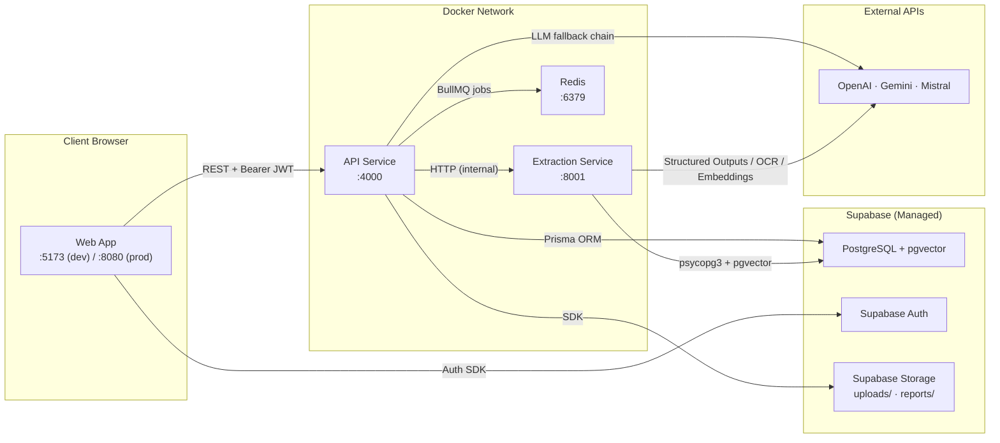
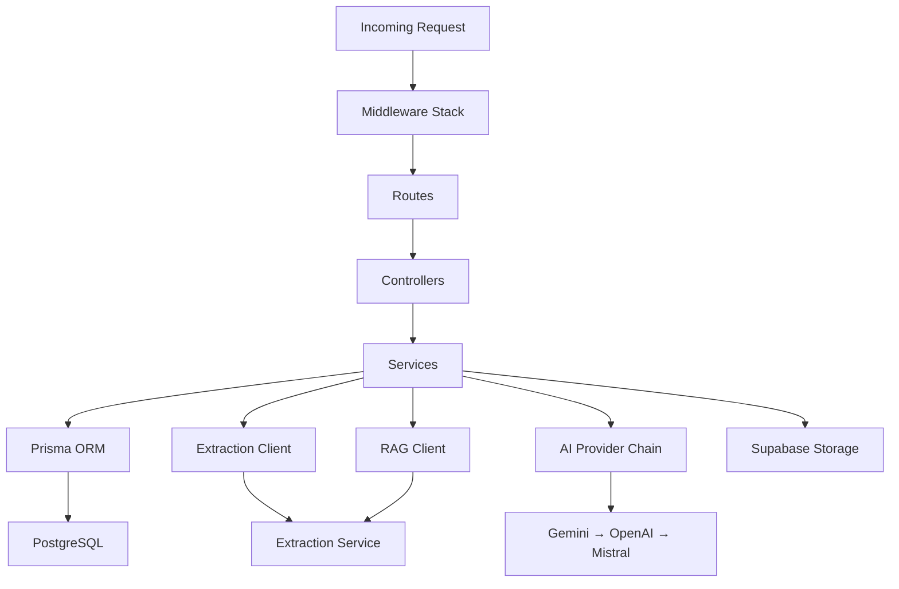
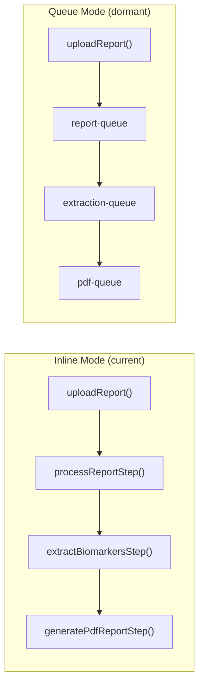
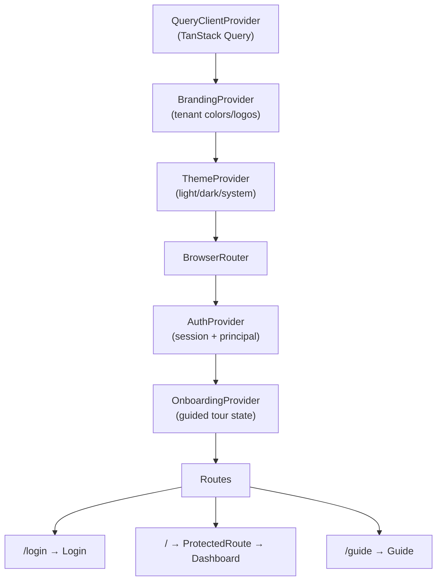
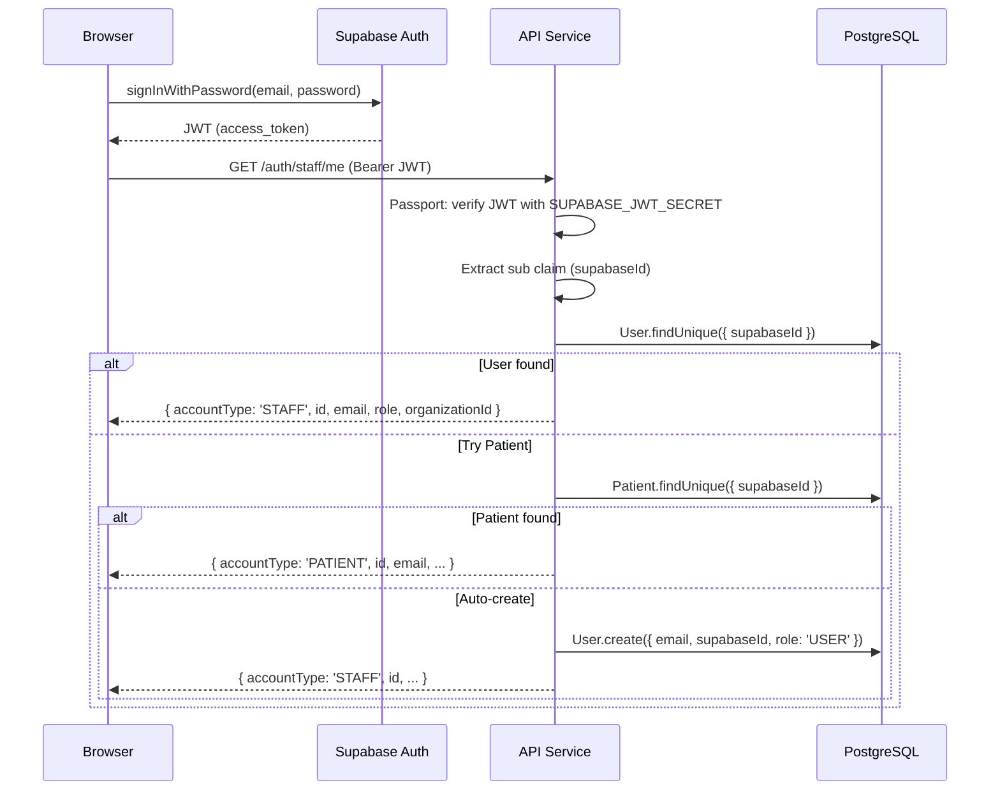
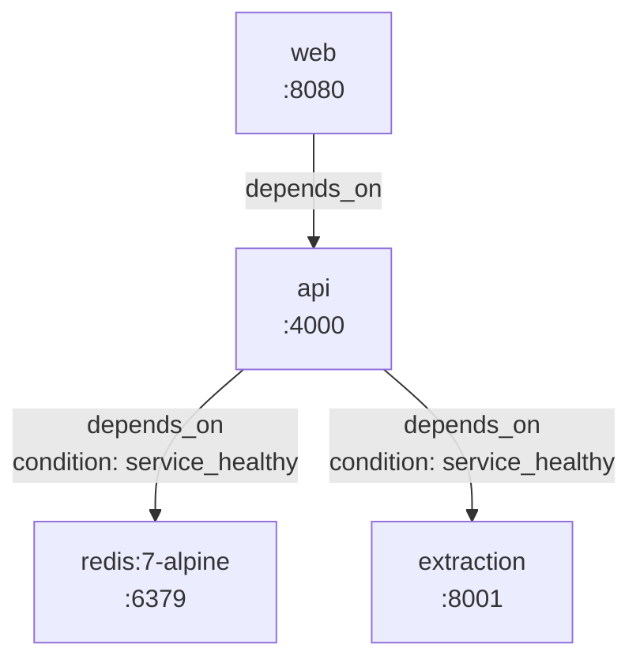

# 01 — System Architecture

## Purpose

This document describes the technical architecture of the HealthLab platform: how the three services are structured internally, how they communicate, how data flows between layers, and how the system is deployed. It covers runtime topology, middleware stacks, inter-service contracts, configuration management, and containerization.

For what the system *does* and why key decisions were made, see `00_PROJECT_OVERVIEW.md`.

---

## Overview

HealthLab is a three-service distributed system orchestrated via Docker Compose. The **Web** frontend (React/Vite) communicates exclusively with the **API** service (Express/Prisma) over REST. The API delegates PDF processing and RAG retrieval to the **Extraction** service (FastAPI/Python) over internal HTTP. All three services share a Supabase-hosted PostgreSQL database (the API via Prisma ORM, the Extraction service via raw pgvector SQL). Redis provides optional queue-backed async processing.

---

## Runtime Topology



### Port Map

| Service | Dev Port | Prod Port | Protocol |
| ------- | -------- | --------- | -------- |
| Web | 5173 (Vite) | 8080 (nginx) | HTTP |
| API | 4000 | 4000 | HTTP |
| Extraction | 8001 | 8001 | HTTP |
| Redis | 6379 | 6379 | TCP |
| PostgreSQL | 5432 (Supabase) | 5432 (Supabase) | TCP |

---

## Service Architectures

### API Service (`apps/api`)

#### Layered Architecture



#### Directory Layout

```
apps/api/src/
├── app.ts                  # Express bootstrap, middleware registration, route mounting
├── auth/
│   ├── passport.ts         # Strategy registration (single call at startup)
│   └── supabase.strategy.ts # JWT validation + principal resolution (User → Patient → auto-create)
├── config/
│   ├── env.ts              # Zod-validated environment schema (fail-fast on missing vars)
│   └── constants.ts        # ACCOUNT_TYPE, STAFF_ROLE, AUTH constants
├── middleware/
│   ├── authGuard.ts        # requireAuth, requireAccountType, requireRole + BYPASS_AUTH mock mode
│   ├── errorHandler.ts     # AppError class + global Express error handler
│   ├── phiMask.ts          # PHI masking middleware stub
│   └── requestLogger.ts    # Request logging middleware
├── routes/                 # Express Router definitions (thin — delegate to controllers)
│   ├── auth.routes.ts
│   ├── report.routes.ts
│   ├── patient.routes.ts
│   ├── chat.routes.ts
│   ├── appointment.routes.ts
│   ├── task.routes.ts
│   └── branding.routes.ts
├── controllers/            # Request handlers — validate input (Zod), call services, format response
├── services/
│   ├── reportPipeline.ts   # 3-step pipeline: intake → extraction → PDF generation
│   ├── extractionService.ts # HTTP client for POST /extract on the Python service
│   ├── ragService.ts       # HTTP client for POST /rag/chat on the Python service
│   ├── chatService.ts      # Chat orchestrator: RAG → Gemini → OpenAI → Mistral fallback
│   ├── brandingService.ts  # In-memory cached branding config (TTL-based, per-org + per-slug)
│   └── userService.ts      # User/Patient CRUD operations
├── ai/
│   ├── types.ts            # ChatProvider interface, ProviderError, ProviderErrorCode
│   ├── gemini.ts           # Google Generative AI SDK wrapper
│   ├── gpt.ts              # OpenAI SDK wrapper
│   └── mistral.ts          # Mistral REST API wrapper
├── queues/                 # BullMQ queue + worker definitions (currently disabled — see below)
│   ├── report.queue.ts
│   ├── extraction.queue.ts
│   └── pdf.queue.ts
├── storage/
│   └── supabase.storage.ts # Bucket management, upload, delete, public URL generation
├── lib/
│   ├── prisma.ts           # Singleton PrismaClient with PrismaPg adapter
│   ├── redis.ts            # Shared ioredis connection (maxRetriesPerRequest: null for BullMQ)
│   └── supabase.ts         # Supabase admin client (service-role key)
├── pdf/                    # Server-side PDF rendering utilities
└── types/
    ├── index.ts            # AuthenticatedPrincipal, SupabaseJwtPayload, ApiResponse<T>
    └── dto.ts              # Zod schemas: patientSignupSchema, staffSignupSchema, loginSchema
```

#### Middleware Stack (order matters)

```
Request
  │
  ├─ helmet()                    # Security headers (CSP, HSTS, etc.)
  ├─ cors({ origin: "*" })       # CORS — open for dev, restrict in production
  ├─ express.json({ limit: 10mb })
  ├─ express.urlencoded()
  ├─ morgan(format)              # Request logging (combined in prod, dev in dev)
  ├─ passport.initialize()       # JWT strategy registration
  │
  ├─ [route-level] requireAuth   # Resolves req.principal from JWT or mock
  ├─ [route-level] requireAccountType('STAFF' | 'PATIENT')
  ├─ [route-level] requireRole('ADMIN', 'DOCTOR', ...)
  │
  └─ errorHandler                # Global catch — AppError → status+message, else 500
```

#### Pipeline Execution Modes

The report processing pipeline supports two execution modes:

| Mode | Status | How It Works |
| ---- | ------ | ------------ |
| **Inline (current default)** | Active | `runReportPipeline()` runs all 3 steps sequentially in-process. No Redis required. |
| **Queue-backed (BullMQ)** | Dormant | Each step is a separate BullMQ job. Queue imports in `app.ts` are commented out. |

The inline mode was adopted to eliminate Redis as a hard runtime dependency during development. To re-enable queue-backed processing: uncomment the three queue imports in `app.ts` and switch the controller from `runReportPipeline` to `enqueueReportProcessing`.



---

### Extraction Service (`apps/extraction`)

#### Directory Layout

```
apps/extraction/app/
├── main.py             # FastAPI app bootstrap, lifespan hook, router registration
├── security.py         # require_service_secret dependency (X-Service-Secret header, HMAC compare)
├── routers/            # FastAPI endpoint definitions (/extract, /normalize, /health)
├── models/             # Pydantic v2 request/response schemas
├── extractors/
│   ├── __init__.py     # Orchestrator: classifier → PyMuPDF ∥ pdfplumber → OCR fallback
│   ├── pymupdf.py      # Native text extraction (confidence 0.95)
│   ├── pdfplumber.py   # Table-aware layout extraction (confidence 0.88)
│   └── mistral_ocr.py  # Mistral OCR API for scanned/image PDFs (confidence 0.75)
├── parsers/            # LLM biomarker parsing, canonical dictionary, normalizer, fuzzy matching, quality scoring, insights
├── phi/
│   ├── __init__.py     # Orchestrator: Presidio + regex merge
│   ├── presidio.py     # NER-based entity detection (spaCy en_core_web_sm)
│   ├── regex_fallback.py # 12 medical regex patterns
│   └── tokenizer.py   # Deterministic bidirectional token vault ([ENTITY_<hash>])
└── rag/
    ├── config.py       # LLM/embedding provider config, dimension validation
    ├── ingestion.py    # Chunk + embed + upsert into document_chunks
    ├── retrieval.py    # Cosine similarity search + dual-mode prompt assembly
    ├── llm.py          # LangChain chat model wrapper (temp 0.3)
    ├── formatting.py   # Response formatting utilities
    └── router.py       # FastAPI router for /rag/chat, /rag/ingest, /rag/health
```

#### Security Model

All PHI-handling endpoints (`/extract`, `/normalize`, `/rag/*`) are protected by a shared service secret:

```
API Service                              Extraction Service
    │                                         │
    ├── X-Service-Secret: <secret> ──────────→├── require_service_secret()
    │                                         │   ├── SECRET unset? → warn + allow (dev)
    │                                         │   ├── hmac.compare_digest() → 200
    │                                         │   └── mismatch → 401
```

The `/health` endpoint is unprotected for infrastructure probes.

---

### Web App (`apps/web`)

#### Provider Hierarchy



#### Key Architectural Patterns

| Pattern | Implementation |
| ------- | -------------- |
| **Dual-endpoint auth** | `AuthContext` tries preferred endpoint first (`/auth/staff/me` or `/auth/patient/me`), falls back to the other on 401. |
| **Multi-tenant theming** | `BrandingContext` fetches org branding by subdomain or `?tenant=` query param, injects CSS custom properties via `MutationObserver` on `.dark` class changes. |
| **Server state** | TanStack Query with 5-minute `staleTime` and 1 retry. |
| **Mock auth bypass** | `BYPASS_AUTH` flag creates mock sessions without Supabase, persists logout in localStorage. |
| **Client-side PDF** | `PremiumPDFDocument.tsx` (72KB) renders branded reports via `@react-pdf/renderer` independent of server PDF generation. |

---

## Inter-Service Communication

### API → Extraction Service

All communication uses HTTP JSON with a shared client pattern:

```typescript
// Shared request pattern (extractionService.ts, ragService.ts)
async function request<T>(path: string, init: RequestInit): Promise<T> {
  // 1. AbortController with configurable timeout (EXTRACTION_SERVICE_TIMEOUT_MS, default 120s)
  // 2. X-Service-Secret header (when configured)
  // 3. Typed error class (ExtractionServiceError / RagServiceError)
  // 4. Abort → timeout error, !res.ok → status error, network → connection error
}
```

| Endpoint | Caller | Purpose | Timeout |
| -------- | ------ | ------- | ------- |
| `POST /extract` | `extractionService.extract()` | Full pipeline: PDF → text → PHI mask → parse → normalize → insights | 120s |
| `POST /rag/chat` | `ragService.chat()` | RAG-grounded clinical chat | 120s |
| `GET /health` | `extractionService.health()` | Health probe for `/health/extraction` | 120s |

### Web → API

Standard REST with Bearer JWT:

```typescript
// Frontend: lib/api.ts
apiFetch<T>(path: string, options?): Promise<T>
// Attaches Supabase session token as Authorization: Bearer <token>
// In BYPASS_AUTH mode, sends mock token
```

### API → Supabase

| Client | Purpose | Key |
| ------ | ------- | --- |
| `supabaseAdmin` (service-role) | User creation, storage ops, bypass RLS | `SUPABASE_SERVICE_ROLE_KEY` |
| Passport JWT strategy | Token validation | `SUPABASE_JWT_SECRET` |

---

## Authentication Architecture



### Dev Bypass Mode

When `BYPASS_AUTH = true` in `authGuard.ts`:
- JWT validation is skipped entirely.
- A mock principal is resolved from the database (or auto-created).
- Account type is inferred from the request path (`/patient/` → PATIENT) or the `X-Mock-Account-Type` header.
- Mock principals are cached in-memory after first resolution to avoid repeated DB queries.

---

## Configuration Management

### API Environment (Zod-validated)

All environment variables are validated at startup via a Zod schema in `config/env.ts`. The process exits immediately on validation failure.

| Variable | Required | Default | Purpose |
| -------- | -------- | ------- | ------- |
| `DATABASE_URL` | Yes | — | Prisma connection (pooled) |
| `DIRECT_DATABASE_URL` | Yes | — | Prisma connection (direct, for migrations) |
| `SUPABASE_URL` | Yes | — | Supabase project URL |
| `SUPABASE_SERVICE_ROLE_KEY` | Yes | — | Admin operations |
| `SUPABASE_JWT_SECRET` | Yes | — | JWT verification |
| `PORT` | No | 4000 | API listen port |
| `NODE_ENV` | No | development | Environment mode |
| `CORS_ORIGIN` | No | `http://localhost:8080` | Allowed origins |
| `REDIS_URL` | No | `redis://localhost:6379` | BullMQ connection |
| `EXTRACTION_SERVICE_URL` | No | `http://localhost:8001` | Extraction service base URL |
| `EXTRACTION_SERVICE_TIMEOUT_MS` | No | 120000 | HTTP timeout for extraction calls |
| `EXTRACTION_SERVICE_SECRET` | No | — | Service-to-service auth header |
| `OPENAI_API_KEY` | No | — | OpenAI LLM + narrative generation |
| `GEMINI_API_KEY` | No | — | Gemini chat fallback |
| `MISTRAL_API_KEY` | No | — | Mistral chat fallback |
| `BRANDING_CACHE_TTL_MS` | No | 300000 | Branding config cache TTL |

### Extraction Environment (dotenv)

| Variable | Required | Default | Purpose |
| -------- | -------- | ------- | ------- |
| `OPENAI_API_KEY` | Yes* | — | Biomarker parsing + embeddings |
| `SUPABASE_DB_URL` | Yes* | — | pgvector direct connection |
| `LLM_PROVIDER` | No | openai | RAG chat LLM provider |
| `LLM_MODEL` | No | gpt-4o-mini | RAG chat model |
| `EMBEDDING_PROVIDER` | No | openai | Embedding provider |
| `EMBEDDING_MODEL` | No | text-embedding-3-small | Embedding model |
| `EMBEDDING_DIMENSION` | No | 1536 | Must match pgvector column |
| `EXTRACTION_SERVICE_SECRET` | No | — | Inbound auth (no-op when unset) |
| `RAG_MAX_DISTANCE` | No | 0.6 | Cosine similarity threshold |

*Degraded mode if unset — warnings logged, LLM/RAG features disabled.

### Frontend Environment (Vite build-time)

| Variable | Purpose |
| -------- | ------- |
| `VITE_API_URL` | API base URL |
| `VITE_SUPABASE_URL` | Supabase project URL |
| `VITE_SUPABASE_ANON_KEY` | Supabase anonymous key (client-side) |

---

## Containerization & Deployment

### Docker Architecture

All three services use multi-stage builds:

| Service | Base Image | Build Stages | Runtime |
| ------- | ---------- | ------------ | ------- |
| API | `node:22-alpine` | deps → build (tsc + prisma generate) → runner | `node dist/app.js` |
| Extraction | `python:3.12-slim` | builder (pip + spacy model) → runner | `uvicorn app.main:app` |
| Web | `node:20-alpine` → `nginx:1.27-alpine` | deps → build (vite build) → nginx static serve | `nginx -g 'daemon off;'` |

### Docker Compose Service Graph



### Health Checks

| Service | Probe | Interval | Start Period |
| ------- | ----- | -------- | ------------ |
| Redis | `redis-cli ping` | 10s | — |
| Extraction | HTTP GET `http://localhost:8001/health` | 30s | 20s |
| API | `wget http://localhost:4000/health` | 30s | 15s |
| Web (nginx) | `GET /healthz` → 200 `ok` | — | — |

### Dev Override (`docker-compose.override.yml`)

Applied automatically by `docker compose up` in development:
- **API**: Runs `pnpm dev` (tsx watch) instead of `node dist/app.js`, mounts `src/` and `prisma/` for hot-reload.
- **Extraction**: Runs `uvicorn --reload`, mounts `app/` for hot-reload.

### Web Static Serving (nginx)

```
location /         → try_files $uri $uri/ /index.html  (SPA fallback)
location /assets/  → expires 1y, Cache-Control: public, immutable (Vite hashed assets)
location /healthz  → 200 'ok' (health probe)
```

---

## Caching Strategy

| Cache | Location | TTL | Invalidation |
| ----- | -------- | --- | ------------ |
| Branding config (per-org, per-slug) | API in-memory `Map` | 5 min (configurable) | Full cache clear on any branding update |
| Mock auth principal | API in-memory `Map` | Process lifetime | Never (static seed data) |
| TanStack Query (frontend) | Browser memory | 5 min `staleTime` | Manual `invalidateQueries` on mutations |
| Supabase Storage bucket existence | API in-memory `Set` | Process lifetime | Never (buckets are immutable once created) |

---

## Error Handling Strategy

### API Layer

| Error Type | Class | HTTP Status | Behavior |
| ---------- | ----- | ----------- | -------- |
| Operational (expected) | `AppError` | Configurable (400, 401, 403, 404, 503) | Status + message returned to client |
| Extraction failure | `ExtractionServiceError` | 502 or 503 | Logged, upload marked FAILED |
| RAG failure | `RagServiceError` | — | Caught, triggers LLM fallback chain |
| LLM provider error | `ProviderError` | — | Caught per-provider, next provider tried |
| All providers exhausted | `AppError` | 503 | Error message lists all provider failures |
| Unexpected | `Error` | 500 | Stack logged, generic message in production |

### Pipeline Failure Handling

```
runReportPipeline(uploadId)
  ├── processReportStep()     → fails? → upload → FAILED, throw
  ├── extractBiomarkersStep() → fails? → upload → FAILED, extraction → FAILED (upsert), throw
  └── generatePdfReportStep() → fails? → upload → FAILED, extraction → FAILED (upsert), throw
```

---

## Design Decisions

### 1. Inline Pipeline vs Queue-Backed Processing

**Decision:** Default to inline (in-process) pipeline execution, with BullMQ queue code preserved but dormant.

**Reason:** During active development, requiring Redis as a hard dependency adds friction. The inline mode runs the same three step functions sequentially without any infrastructure dependency. The queue code is kept intact for production activation.

**Trade-off:** Inline mode blocks the Express request thread for the full pipeline duration (30–120s). Under concurrent load, this would exhaust the Node event loop. Queue mode must be re-enabled before production scale.

---

### 2. Typed HTTP Clients Over SDK/gRPC

**Decision:** Inter-service communication uses plain HTTP with typed TypeScript wrapper functions (`extractionService.ts`, `ragService.ts`), not gRPC or a generated SDK.

**Reason:** The extraction service has a small API surface (3 endpoints). A typed fetch wrapper with `AbortController` timeout, custom error classes, and shared-secret headers provides sufficient safety without build tooling overhead.

**Trade-off:** No compile-time contract enforcement between services. Request/response types are manually mirrored.

---

### 3. Zod for Environment Validation

**Decision:** Parse all environment variables through a Zod schema at startup.

**Reason:** Fail-fast on misconfiguration prevents silent runtime errors (e.g., missing `DATABASE_URL` causing a connection error 30 seconds after startup). Zod provides coercion (string → number for `PORT`), defaults, and descriptive error messages.

---

### 4. Singleton Prisma Client with PrismaPg Adapter

**Decision:** Use `@prisma/adapter-pg` (PrismaPg) with a global singleton pattern.

**Reason:** The PrismaPg driver adapter provides direct PostgreSQL wire-protocol access, bypassing the Prisma Engine binary. The singleton pattern prevents connection pool exhaustion during `tsx watch` hot-reloads in development.

---

### 5. Multi-Tenant Branding via CSS Custom Properties

**Decision:** Resolve tenant identity from subdomain or `?tenant=` query parameter, fetch branding config, and inject HSL color values as CSS custom properties on `document.documentElement`.

**Reason:** CSS custom properties cascade through the entire component tree without React re-renders. A `MutationObserver` on the `.dark` class toggle ensures dark mode colors are swapped reactively.

**Trade-off:** The branding fetch happens before any authenticated request, so it uses the public `/branding/:slug` endpoint (no auth required). Branding data is non-sensitive.

---

## Related Documents

| Document | Relevance |
| -------- | --------- |
| `00_PROJECT_OVERVIEW.md` | High-level system description and design decision rationale |
| `03_DATABASE_SCHEMA.md` | Prisma model relationships and indexing strategy |
| `04_EXTRACTION_PIPELINE.md` | PDF extraction cascade and normalizer internals |
| `08_QUEUE_SYSTEM.md` | BullMQ topology, worker config, inline vs queue mode |
| `09_AUTH_AND_MULTITENANCY.md` | Supabase auth, JWT validation, org scoping details |
| `10_DEPLOYMENT.md` | Docker Compose, CI/CD, Vercel config |

---

## Current Status

**In Progress**

Core architecture is stable and deployed. Queue-backed processing is dormant (inline mode active). Service-to-service auth is implemented but optional in dev.

---

### Revision History

| Date       | Change                                              |
| ---------- | --------------------------------------------------- |
| 2026-06-30 | Initial document created from codebase architecture audit. |
