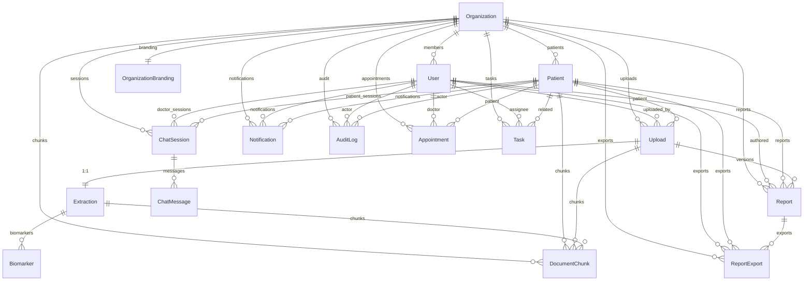

# 03 — Database Schema

## Purpose

This document describes the PostgreSQL data model powering the HealthLab platform — every Prisma model, its relationships, indexing strategy, enum definitions, and the pgvector tables that back the RAG system. It also covers migration history and key schema design decisions.

For how these models are queried at runtime, see `02_SYSTEM_DESIGN.md`.

---

## Entity-Relationship Diagram



---

## Model Reference

### Organization

The tenant boundary. Every data entity in the system belongs to exactly one organization.

| Column | Type | Constraint | Notes |
| ------ | ---- | ---------- | ----- |
| `id` | `uuid` | PK | |
| `name` | `String` | | Display name |
| `slug` | `String` | Unique | URL-safe identifier, used for branding lookup |
| `plan` | `OrganizationPlan` | Default: `FREE` | Gates feature flags (e.g., `showPoweredBy`, `customFontsEnabled`) |
| `createdAt` | `DateTime` | | |
| `updatedAt` | `DateTime` | Auto | |

**Table:** `organizations`

---

### OrganizationBranding

1:1 extension of Organization for tenant-specific theming. Stores HSL color values as plain strings for direct CSS custom property injection.

| Column | Type | Default | Notes |
| ------ | ---- | ------- | ----- |
| `id` | `uuid` | PK | |
| `brandName` | `String` | `"Auriem"` | |
| `tagline` | `String?` | | |
| `poweredByText` | `String` | `"POWERED BY HUUMANIZE"` | |
| `logoMainUrl` | `String?` | | Supabase Storage URL |
| `logoIconUrl` | `String?` | | Square icon |
| `logoLetterformUrl` | `String?` | | Compact lettermark |
| `faviconUrl` | `String?` | | |
| `colorPrimary` | `String` | `"25 31% 75%"` | HSL without `hsl()` wrapper |
| `colorPrimaryForeground` | `String` | `"0 0% 100%"` | |
| `colorPrimaryText` | `String` | `"25 20% 48%"` | |
| `colorPrimaryGlow` | `String` | `"25 31% 75%"` | |
| `colorAccent` | `String` | `"30 11% 69%"` | |
| `colorPrimaryDark` | `String` | `"27 15% 49%"` | Dark mode override |
| `colorPrimaryForegroundDark` | `String` | `"0 0% 100%"` | |
| `colorPrimaryTextDark` | `String` | `"27 25% 65%"` | |
| `colorAccentDark` | `String` | `"30 11% 45%"` | |
| `pdfAccentColor` | `String` | `"#D4BDAD"` | Hex for react-pdf |
| `pdfHeaderBg` | `String` | `"#1f2937"` | Hex |
| `pdfThemePreset` | `String` | `"warm-gold"` | Named preset |
| `showPoweredBy` | `Boolean` | `true` | Plan-gated |
| `customFontsEnabled` | `Boolean` | `false` | Plan-gated |
| `fontFamily` | `String?` | | Google Fonts family |
| `organizationId` | `String` | Unique FK | 1:1 with Organization |

**Table:** `organization_brandings` · **Unique index:** `organizationId`

---

### User (Staff)

Clinicians, admins, and staff members. Distinct from Patient — different field sets, auth flows, and query patterns.

| Column | Type | Constraint | Notes |
| ------ | ---- | ---------- | ----- |
| `id` | `uuid` | PK | |
| `email` | `String` | Unique | |
| `firstName` | `String?` | | |
| `lastName` | `String?` | | |
| `avatarUrl` | `String?` | | |
| `role` | `Role` | Default: `USER` | `USER`, `ADMIN`, `DOCTOR` |
| `note` | `Text?` | | Free-form clinician notes |
| `supabaseId` | `String?` | Unique | Links to Supabase Auth user |
| `organizationId` | `String?` | FK | |

**Table:** `users` · **Indexes:** `organizationId`, `email`

---

### Patient

| Column | Type | Constraint | Notes |
| ------ | ---- | ---------- | ----- |
| `id` | `uuid` | PK | |
| `email` | `String` | Unique | |
| `firstName` | `String?` | | |
| `lastName` | `String?` | | |
| `avatarUrl` | `String?` | | |
| `dateOfBirth` | `DateTime` | Required | |
| `gender` | `Gender` | Required | `MALE`, `FEMALE`, `OTHER` |
| `note` | `Text?` | | |
| `supabaseId` | `String?` | Unique | |
| `organizationId` | `String?` | FK | |

**Table:** `patients` · **Indexes:** `organizationId`, `email`

---

### Upload

Represents a single uploaded PDF file. The pipeline entry point.

| Column | Type | Constraint | Notes |
| ------ | ---- | ---------- | ----- |
| `id` | `uuid` | PK | |
| `fileName` | `String` | | Original filename |
| `fileUrl` | `String` | | Supabase Storage public URL |
| `fileType` | `FileType` | | `PDF`, `IMAGE`, `CSV`, `OTHER` |
| `fileSize` | `Int` | | Bytes |
| `status` | `ProcessingStatus` | Default: `PENDING` | `PENDING → PROCESSING → COMPLETED / FAILED` |
| `userId` | `String?` | FK (SetNull) | Staff who triggered upload (null for patient self-upload) |
| `patientId` | `String` | FK (Cascade) | |
| `organizationId` | `String` | FK (Cascade) | |

**Table:** `uploads` · **Indexes:** `patientId`, `userId`, `organizationId`, `status`, `createdAt`

---

### Extraction

1:1 with Upload. Stores the raw extraction output and tracks which extractor won.

| Column | Type | Constraint | Notes |
| ------ | ---- | ---------- | ----- |
| `id` | `uuid` | PK | |
| `rawData` | `Json?` | | Full extraction result (masked text, metadata, API logs) |
| `status` | `ProcessingStatus` | Default: `PENDING` | Reuses same enum as Upload |
| `source` | `String?` | | Winning extractor: `pymupdf`, `pdfplumber`, `mistral_ocr` |
| `confidence` | `Float?` | | Quality engine composite score (0–1) |
| `version` | `Int` | Default: `1` | Incremented on re-processing |
| `uploadId` | `String` | Unique FK | 1:1 with Upload |

**Table:** `extractions` · **Index:** `status`

---

### Biomarker

Individual biomarker readings extracted from a report. Uses `Decimal(10,4)` to avoid floating-point precision errors in medical values.

| Column | Type | Constraint | Notes |
| ------ | ---- | ---------- | ----- |
| `id` | `uuid` | PK | |
| `canonicalName` | `String` | | Dictionary key (e.g., `hemoglobin`) |
| `displayName` | `String` | | Human-readable (e.g., `Hemoglobin`) |
| `value` | `Decimal(10,4)` | | Medical precision — never `Float` |
| `unit` | `String` | | Preferred unit after conversion |
| `referenceRange` | `String?` | | Display string (e.g., `12.0 - 17.5 g/dL`) |
| `status` | `BiomarkerStatus` | Default: `NORMAL` | `LOW`, `NORMAL`, `HIGH`, `CRITICAL` |
| `category` | `String?` | | Clinical panel (e.g., `CBC`, `Lipid Panel`) |
| `referenceMin` | `Decimal(10,4)?` | | Numeric lower bound |
| `referenceMax` | `Decimal(10,4)?` | | Numeric upper bound |
| `confidence` | `Float?` | | Name resolution confidence (0–1) |
| `source` | `BiomarkerSource?` | Default: `EXTRACTED` | `EXTRACTED`, `MANUAL`, `CALCULATED` |
| `extractionId` | `String` | FK (Cascade) | |

**Table:** `biomarkers` · **Indexes:** `(extractionId, category)`, `(extractionId, status)`, `status`

---

### Report

Generated clinical report. Supports versioning — multiple versions per upload, with `isLatest` flag.

| Column | Type | Constraint | Notes |
| ------ | ---- | ---------- | ----- |
| `id` | `uuid` | PK | |
| `title` | `String` | | |
| `summary` | `Text?` | | AI-generated narrative summary |
| `insights` | `Json?` | | Structured: `{flags[], recommendations[], summaryPoints[]}` |
| `insightsSchemaVersion` | `Int` | Default: `1` | Migration safety for JSON shape changes |
| `status` | `ReportStatus` | Default: `DRAFT` | `DRAFT → GENERATED → REVIEWED → PUBLISHED` |
| `uploadId` | `String?` | FK (SetNull) | |
| `version` | `Int` | Default: `1` | |
| `isLatest` | `Boolean` | Default: `true` | Only one `true` per upload |
| `userId` | `String?` | FK (SetNull) | Staff author |
| `patientId` | `String?` | FK | |
| `organizationId` | `String` | FK (Cascade) | |
| `pdfUrl` | `String?` | | Quick reference to last export URL |

**Table:** `reports` · **Indexes:** `userId`, `patientId`, `organizationId`, `status`, `createdAt`, `(uploadId, isLatest)`

---

### ReportExport

Tracks every PDF export event for compliance auditing.

| Column | Type | Notes |
| ------ | ---- | ----- |
| `id` | `uuid` | PK |
| `pdfUrl` | `String` | Supabase Storage URL |
| `expiresAt` | `DateTime?` | Signed URL expiry (null = permanent) |
| `reportId` | `String` | FK (Cascade) |
| `organizationId` | `String` | FK (Cascade) |
| `generatedByUserId` | `String?` | FK — polymorphic actor (staff) |
| `generatedByPatientId` | `String?` | FK — polymorphic actor (patient) |

**Table:** `report_exports` · **Indexes:** `reportId`, `organizationId`

---

### ChatSession / ChatMessage

Multi-session chat history. Sessions are scoped to a patient, owned by either a staff user or the patient themselves.

**ChatSession:**

| Column | Type | Notes |
| ------ | ---- | ----- |
| `id` | `uuid` | PK |
| `title` | `String?` | Auto-derived from first message (50 char cap) |
| `userId` | `String?` | FK — staff owner (null if patient-owned) |
| `patientId` | `String?` | FK — patient context |
| `organizationId` | `String` | FK (Cascade) |

**Table:** `chat_sessions` · **Indexes:** `userId`, `patientId`, `organizationId`

**ChatMessage:**

| Column | Type | Notes |
| ------ | ---- | ----- |
| `id` | `uuid` | PK |
| `role` | `MessageRole` | `USER`, `ASSISTANT`, `SYSTEM` |
| `content` | `Text` | Full message body |
| `sessionId` | `String` | FK (Cascade) |

**Table:** `chat_messages` · **Index:** `(sessionId, createdAt)`

---

### Notification

| Column | Type | Notes |
| ------ | ---- | ----- |
| `id` | `uuid` | PK |
| `type` | `NotificationType` | See enum below |
| `message` | `String` | |
| `read` | `Boolean` | Default: `false` |
| `organizationId` | `String` | FK |
| `userId` | `String?` | Polymorphic recipient (staff) |
| `patientId` | `String?` | Polymorphic recipient (patient) |
| `entityType` | `String?` | e.g., `"Report"`, `"Upload"` |
| `entityId` | `String?` | Links to the triggering entity |

**Table:** `notifications` · **Indexes:** `(userId, read)`, `(patientId, read)`, `organizationId`

---

### AuditLog

Immutable compliance log. Records who did what, to which entity, from where.

| Column | Type | Notes |
| ------ | ---- | ----- |
| `id` | `uuid` | PK |
| `action` | `AuditAction` | See enum below |
| `entityType` | `String` | e.g., `"Report"`, `"Upload"` |
| `entityId` | `String` | |
| `actorUserId` | `String?` | Polymorphic actor (staff) |
| `actorPatientId` | `String?` | Polymorphic actor (patient) |
| `organizationId` | `String` | FK |
| `metadata` | `Json?` | IP, user agent, diff snapshot |
| `ipAddress` | `String?` | |

**Table:** `audit_logs` · **Indexes:** `(entityType, entityId)`, `(actorUserId, createdAt)`, `(actorPatientId, createdAt)`, `(organizationId, createdAt)`

---

### Appointment

| Column | Type | Notes |
| ------ | ---- | ----- |
| `id` | `uuid` | PK |
| `title` | `String` | |
| `notes` | `Text?` | |
| `startTime` | `DateTime` | |
| `endTime` | `DateTime?` | |
| `status` | `AppointmentStatus` | `SCHEDULED`, `COMPLETED`, `CANCELLED`, `NO_SHOW` |
| `organizationId` | `String` | FK |
| `patientId` | `String` | FK |
| `userId` | `String?` | FK — assigned doctor |

**Table:** `appointments` · **Indexes:** `(organizationId, startTime)`, `patientId`

---

### Task

| Column | Type | Notes |
| ------ | ---- | ----- |
| `id` | `uuid` | PK |
| `title` | `String` | |
| `description` | `Text?` | |
| `status` | `TaskStatus` | `TODO`, `IN_PROGRESS`, `DONE` |
| `priority` | `TaskPriority` | `LOW`, `MEDIUM`, `HIGH` |
| `dueDate` | `DateTime?` | |
| `organizationId` | `String` | FK |
| `userId` | `String?` | FK — staff assignee |
| `patientId` | `String?` | FK — related patient |

**Table:** `tasks` · **Index:** `(organizationId, status)`

---

## Vector Store Tables

These tables are modeled in Prisma but primarily read/written by the Python extraction service via raw SQL + psycopg3.

### DocumentChunk

Per-patient embedded content for RAG retrieval.

| Column | Type | Notes |
| ------ | ---- | ----- |
| `id` | `Text` | PK (UUID set by Python) |
| `patientId` | `Text` | FK (Cascade) |
| `uploadId` | `Text?` | FK (Cascade) |
| `extractionId` | `Text?` | FK (Cascade) |
| `organizationId` | `Text?` | FK (Cascade) — tenant isolation |
| `chunkType` | `Text` | `report_text`, `biomarker_summary`, `biomarker`, `clinical_insight` |
| `chunkIndex` | `Int` | Default: `0` |
| `content` | `Text` | Embedded text |
| `metadata` | `JSONB` | Default: `{}` — structured metadata for GIN filtering |
| `embedding` | `vector(1536)` | OpenAI `text-embedding-3-small` output |
| `reportType` | `Text?` | Derived from biomarker categories |
| `reportDate` | `DateTime?` | Parsed from raw text (pre-masking) |

**Table:** `document_chunks`

**Indexes:**

| Index | Type | Columns | Purpose |
| ----- | ---- | ------- | ------- |
| Composite btree | B-tree | `(patient_id, chunk_type)` | Patient-scoped type filtering |
| Org btree | B-tree | `organization_id` | Tenant isolation queries |
| Report type btree | B-tree | `report_type` | Panel-type filtering |
| Report date btree | B-tree | `report_date` | Temporal ordering |
| Embedding HNSW | HNSW | `embedding vector_cosine_ops` | Approximate nearest neighbor search |
| Metadata GIN | GIN | `metadata` | JSONB key/value filtering |

### KnowledgeBaseChunk

Global clinical reference content (not patient-scoped).

| Column | Type | Notes |
| ------ | ---- | ----- |
| `id` | `Text` | PK |
| `topic` | `Text` | e.g., `"Iron Deficiency"` |
| `content` | `Text` | |
| `metadata` | `JSONB` | Default: `{}` |
| `embedding` | `vector(1536)` | |

**Table:** `knowledge_base_chunks`

**Indexes:** HNSW on `embedding`, GIN on `metadata`

> [!IMPORTANT]
> The `embedding` column uses `Unsupported("vector(1536)")` in Prisma because the `vector` type is not natively supported. HNSW indexes are created via raw SQL in migrations, not declarable in `schema.prisma`.

---

## Enum Definitions

### Identity & Roles

| Enum | Values | Usage |
| ---- | ------ | ----- |
| `Gender` | `MALE`, `FEMALE`, `OTHER` | Patient profile |
| `Role` | `USER`, `ADMIN`, `DOCTOR` | Staff-only roles |
| `OrganizationPlan` | `FREE`, `PRO`, `ENTERPRISE` | Feature gating |

### Processing Pipeline

| Enum | Values | Usage |
| ---- | ------ | ----- |
| `ProcessingStatus` | `PENDING`, `PROCESSING`, `COMPLETED`, `FAILED` | Upload + Extraction (unified) |
| `FileType` | `PDF`, `IMAGE`, `CSV`, `OTHER` | Upload file classification |
| `BiomarkerStatus` | `LOW`, `NORMAL`, `HIGH`, `CRITICAL` | Post-normalization classification |
| `BiomarkerSource` | `EXTRACTED`, `MANUAL`, `CALCULATED` | Data provenance |
| `ReportStatus` | `DRAFT`, `GENERATED`, `REVIEWED`, `PUBLISHED` | Report lifecycle |

### Communication

| Enum | Values | Usage |
| ---- | ------ | ----- |
| `MessageRole` | `USER`, `ASSISTANT`, `SYSTEM` | Chat message authorship |
| `NotificationType` | `REPORT_READY`, `REPORT_EXPORTED`, `EXTRACTION_FAILED`, `UPLOAD_FAILED`, `UPLOAD_COMPLETED`, `ACCOUNT_UPDATE` | Notification classification |

### Scheduling

| Enum | Values | Usage |
| ---- | ------ | ----- |
| `AppointmentStatus` | `SCHEDULED`, `COMPLETED`, `CANCELLED`, `NO_SHOW` | |
| `TaskStatus` | `TODO`, `IN_PROGRESS`, `DONE` | |
| `TaskPriority` | `LOW`, `MEDIUM`, `HIGH` | |

### Compliance

| Enum | Values |
| ---- | ------ |
| `AuditAction` | `UPLOAD_CREATED`, `UPLOAD_DELETED`, `UPLOAD_REPROCESSED`, `REPORT_CREATED`, `REPORT_UPDATED`, `REPORT_PUBLISHED`, `REPORT_EXPORTED`, `REPORT_DELETED`, `PATIENT_CREATED`, `PATIENT_UPDATED`, `PATIENT_DELETED`, `USER_LOGIN`, `USER_LOGOUT`, `USER_ROLE_CHANGED`, `CHAT_SESSION_CREATED`, `CHAT_SESSION_DELETED` |

---

## Indexing Strategy

### Design Principles

1. **Organization-first:** Every queryable table indexes `organizationId` for tenant-scoped queries.
2. **Compound indexes for hot paths:** `(extractionId, category)` for biomarker panel grouping, `(uploadId, isLatest)` for latest-report resolution, `(sessionId, createdAt)` for chronological message retrieval.
3. **Read-optimized audit:** AuditLog indexes `(actorUserId, createdAt)` and `(organizationId, createdAt)` for time-ordered compliance queries.
4. **Notification read-state:** `(userId, read)` and `(patientId, read)` for unread-count queries without full table scans.
5. **Vector indexes separate from btree:** HNSW indexes for approximate nearest neighbor on `embedding` columns, GIN indexes for JSONB metadata filtering — both created via raw SQL migrations.

---

## Prisma Configuration

### Connection Strategy

```
prisma.config.ts → DIRECT_DATABASE_URL → migrations (direct)
lib/prisma.ts    → DATABASE_URL        → runtime queries (pooled via PrismaPg adapter)
```

| Config | Variable | Purpose |
| ------ | -------- | ------- |
| Migration CLI | `DIRECT_DATABASE_URL` | Direct connection for DDL operations |
| Runtime ORM | `DATABASE_URL` | Pooled connection via `@prisma/adapter-pg` (PrismaPg) |

The PrismaPg adapter bypasses the Prisma Engine binary, using the PostgreSQL wire protocol directly. A global singleton pattern prevents connection pool exhaustion during hot-reloads.

### Extensions

```sql
CREATE EXTENSION IF NOT EXISTS vector;
```

The `pgvector` extension is enabled in the initial RAG migration. It provides the `vector(1536)` column type and the `<=>` cosine distance operator used in retrieval queries.

---

## Migration History

| Migration | Date | Changes |
| --------- | ---- | ------- |
| `20260528_init` | 2026-05-28 | All core tables: users, patients, organizations, uploads, extractions, biomarkers, reports, report_exports, chat_sessions, chat_messages, notifications, audit_logs, appointments, tasks |
| `20260601_add_appointments_and_tasks` | 2026-06-01 | Appointment and Task models (may have refined initial schema) |
| `20260608_add_document_chunks` | 2026-06-08 | `pgvector` extension, `document_chunks` + `knowledge_base_chunks` tables, HNSW indexes |
| `20260617_document_chunks_metadata` | 2026-06-17 | Added `organization_id`, `report_type`, `report_date` to `document_chunks`; GIN indexes on metadata |
| `20260618_documents_chunks_metadata` | 2026-06-18 | Auto-generated migration that accidentally dropped chunk tables (not Prisma-modeled at the time) |
| `20260618_restore_rag_chunks` | 2026-06-18 | Recreated both chunk tables with all columns, indexes, and FKs. Tables now modeled in `schema.prisma` to prevent future drift. |
| `20260622_add_org_branding` | 2026-06-22 | `organization_brandings` table with HSL colors, PDF theme, logos, feature flags |

> [!WARNING]
> Migration `20260618025738` caused data loss by dropping the chunk tables. The `20260618050000_restore` migration recreated them, but existing embeddings were lost. Document chunks repopulate as reports are re-ingested; knowledge base chunks require re-seeding via `python seed_kb.py`.

---

## Design Decisions

### 1. Separate User and Patient Tables

**Decision:** Model staff and patients as distinct tables rather than a single `actors` table with a type discriminator.

**Reason:** Staff and patients have fundamentally different field sets (`role` vs `dateOfBirth/gender`), different auth flows (Supabase metadata lookup path), different query patterns (staff query all patients; patients query only their own data), and different relationship cardinalities.

**Trade-off:** Polymorphic FK pairs (`userId?` + `patientId?`) on shared entities (AuditLog, Notification, ReportExport, ChatSession) with app-layer enforcement of exactly-one-non-null.

### 2. Decimal(10,4) for Biomarker Values

**Decision:** Use `Decimal(10,4)` instead of `Float` for all biomarker numeric values.

**Reason:** Floating-point arithmetic produces rounding errors (e.g., `0.1 + 0.2 = 0.30000000000000004`). In medical diagnostics, a value of `5.0000` vs `4.9999` can change a status classification from NORMAL to LOW. Fixed-precision `Decimal` eliminates this class of bugs entirely.

### 3. Unified ProcessingStatus Enum

**Decision:** Merge the original separate `UploadStatus` and `ExtractionStatus` enums into a single `ProcessingStatus`.

**Reason:** Both enums had identical values (`PENDING`, `PROCESSING`, `COMPLETED`, `FAILED`). Maintaining two identical enums increased cognitive load and created opportunities for drift.

### 4. Report Versioning via isLatest Flag

**Decision:** Support multiple Report rows per Upload with a `version` counter and `isLatest` boolean, rather than overwriting.

**Reason:** Preserves audit trail of previous report generations. The compound index `(uploadId, isLatest)` makes latest-report lookup efficient. App-layer logic sets `isLatest = false` on old versions when generating a new one.

### 5. RAG Tables in Prisma Schema

**Decision:** Model `DocumentChunk` and `KnowledgeBaseChunk` in `schema.prisma` using `Unsupported("vector(1536)")` for the embedding column.

**Reason:** Initially these tables existed only as raw SQL. When a Prisma migration ran, it treated the tables as "drift" and auto-generated a DROP — causing data loss (see migration `20260618025738`). Modeling them in Prisma prevents this, even though the tables are read/written by Python via raw SQL, not through the Prisma client.

---

## Related Documents

| Document | Relevance |
| -------- | --------- |
| `01_ARCHITECTURE.md` | Prisma client setup, connection pooling, adapter config |
| `02_SYSTEM_DESIGN.md` | How normalizer, quality engine, and RAG system interact with these models |
| `04_EXTRACTION_PIPELINE.md` | Extraction → Biomarker write path in detail |

---

### Revision History

| Date       | Change |
| ---------- | ------ |
| 2026-06-30 | Initial document generated from `schema.prisma` (664 lines) and 7 migrations. |
