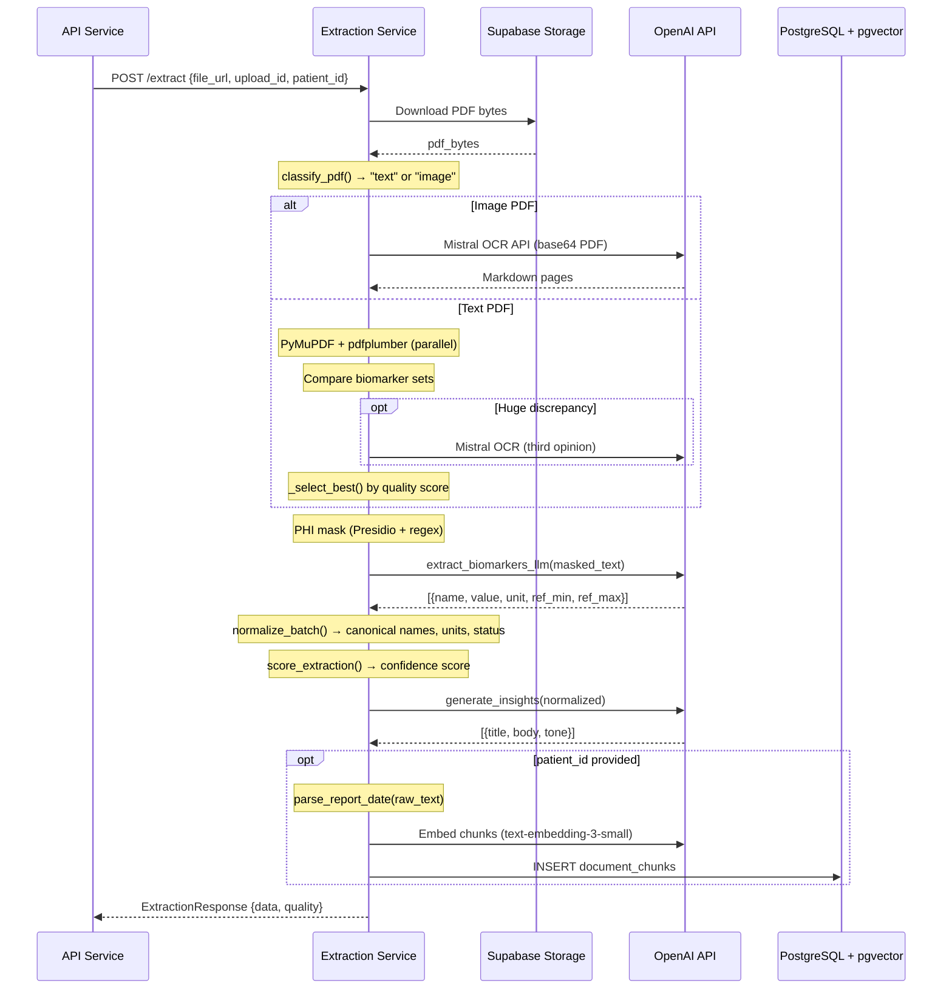
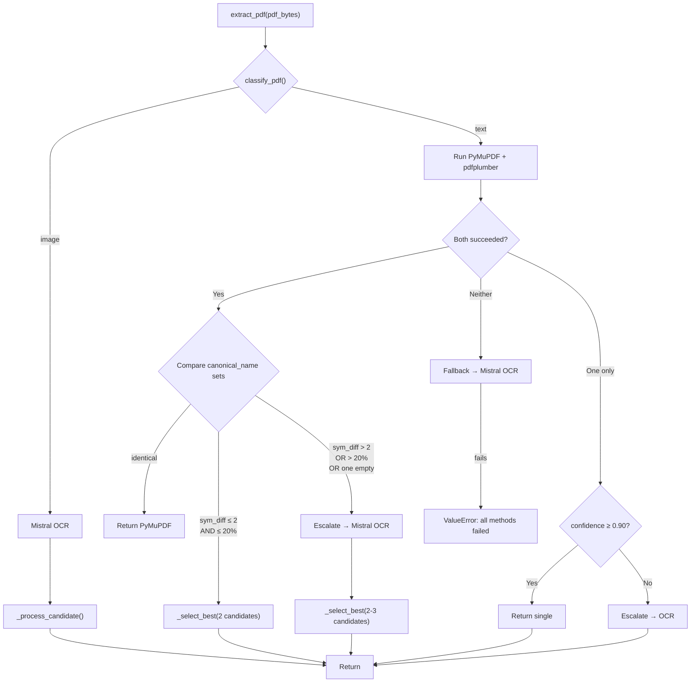
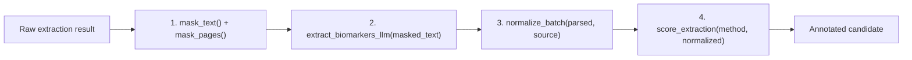
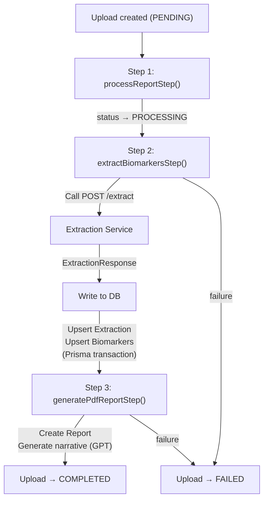

# 04 — Extraction Pipeline

## Purpose

This document provides an exhaustive walkthrough of the PDF extraction pipeline — from the moment a file URL arrives at the Python service through text extraction, PHI masking, LLM-based biomarker parsing, normalization, quality scoring, clinical insight generation, and RAG ingestion. It covers every module, every decision branch, and every data shape transformation.

For the API-side orchestration that invokes this pipeline, see `01_ARCHITECTURE.md` (pipeline execution modes). For schema details of the data written, see `03_DATABASE_SCHEMA.md`.

---

## End-to-End Pipeline



---

## Stage 1: PDF Download

```python
async def download_file(file_url: str) -> bytes:
```

Downloads the PDF from its Supabase Storage public URL via `httpx.AsyncClient` with a 60-second timeout. The full byte payload is held in memory for the duration of extraction.

**Input:** Supabase Storage URL (public, deterministic).
**Output:** `bytes` — raw PDF content.
**Failure:** `httpx` raises on non-2xx status or timeout.

---

## Stage 2: PDF Classification

```python
def classify_pdf(pdf_bytes: bytes) -> str:  # "text" | "image"
```

Opens the PDF with PyMuPDF and counts total extractable characters across all pages. If the total exceeds `MIN_TEXT_LENGTH` (50 chars), the PDF is classified as `"text"`. Otherwise, it's `"image"` (scanned/photographed) and routes directly to OCR.

| Result | Threshold | Routing |
| ------ | --------- | ------- |
| `"text"` | ≥ 50 chars | PyMuPDF + pdfplumber (parallel) |
| `"image"` | < 50 chars | Mistral OCR (direct) |

**Design choice:** The 50-char threshold is intentionally low — even a mostly-scanned PDF with a small text header should try text extraction first, as the fallback cascade handles quality issues.

---

## Stage 3: Text Extraction

### Extractor Comparison

| Extractor | Library | Strengths | Base Confidence | Speed |
| --------- | ------- | --------- | --------------- | ----- |
| **PyMuPDF** | `fitz` (MuPDF bindings) | Fast native text extraction, reliable for well-formed PDFs | 0.95 | ~50ms |
| **pdfplumber** | `pdfplumber` | Table-aware layout extraction, captures structured tabular data | 0.88 | ~200ms |
| **Mistral OCR** | Mistral AI API | Handles scanned/image PDFs, returns Markdown | 0.75 | ~5-30s |

### PyMuPDF (`extractors/pymupdf.py`)

Iterates pages via `fitz.open()`, calls `page.get_text("text")` per page. Returns `None` if total text is below 50 chars.

**Output shape:**
```python
{
    "text": str,           # Full concatenated text
    "method": "pymupdf",
    "confidence": 0.95,
    "page_count": int,
    "pages": [{"page": 1, "text": "..."}],
    "metadata": {},
}
```

### pdfplumber (`extractors/pdfplumber.py`)

For each page, runs both `extract_text()` (standard) and `extract_tables()` (structured). Table rows are converted to plain text via `_tables_to_text()` — cells joined by double-space, rows by newline — and appended to the page text. This ensures biomarkers in HTML-style table layouts are captured.

### Mistral OCR (`extractors/mistral_ocr.py`)

Base64-encodes the entire PDF, sends it to `https://api.mistral.ai/v1/ocr` using the `mistral-ocr-latest` model, and parses the returned Markdown per page. Requires `MISTRAL_API_KEY`. Timeout: 120 seconds.

### Orchestrator Decision Logic (`extractors/__init__.py`)



**`_select_best(candidates)`:** Ranks by `(quality.confidence_score, len(normalized_biomarkers))` — highest confidence wins, biomarker count breaks ties.

---

## Stage 4: Candidate Processing

Every extraction candidate (regardless of extractor) passes through `_process_candidate()`:



### Step 4a: PHI Masking

**Module:** `app/phi/`

Two detectors run in parallel, results are merged:

**Presidio Analyzer** (`phi/presidio.py`):
- Engine: spaCy `en_core_web_sm` NER model
- Entities: PERSON, PHONE_NUMBER, EMAIL_ADDRESS, DATE_TIME, LOCATION, US_SSN, US_DRIVER_LICENSE, CREDIT_CARD, IP_ADDRESS, NRP, MEDICAL_LICENSE, US_PASSPORT
- Score threshold: 0.4
- **Medical whitelist** (40+ terms): prevents false positives on clinical terms like "hemoglobin", "LDL cholesterol", "thyroid panel"
- **Numeric filter**: skips pure numbers (lab values) that NER may tag as CARDINAL
- **Label suppression**: 12 spaCy entity types (CARDINAL, PERCENT, ORDINAL, etc.) are silenced to prevent log flooding

**Regex Fallback** (`phi/regex_fallback.py`):

| Pattern | Entity Type | Confidence | Example Match |
| ------- | ----------- | ---------- | ------------- |
| `MRN\s*:?\s*(\d{4,12})` | MRN | 0.85 | `MRN: 123456789` |
| `Patient\s*ID\s*:?\s*([A-Z0-9-]{4,20})` | PATIENT_ID | 0.85 | `PID: ABC-1234` |
| `DOB\s*:?\s*(\d{1,2}[/-]\d{1,2}[/-]\d{2,4})` | DOB | 0.90 | `DOB: 01/15/1990` |
| `\d{3}-?\d{2}-?\d{4}` | SSN | 0.80 | `123-45-6789` |
| `\d{4}\s?\d{4}\s?\d{4}` | AADHAAR | 0.70 | `1234 5678 9012` |
| `[6-9]\d{9}` (Indian) | PHONE | 0.85 | `9876543210` |
| `\(?\d{3}\)?-?\d{3}-?\d{4}` (US) | PHONE | 0.85 | `(555) 123-4567` |
| `[...]+@[...]+\.[...]{2,}` | EMAIL | 0.95 | `john@email.com` |
| `Age\s*:?\s*(\d{1,3})\s*(years?)?` | AGE | 0.80 | `Age: 45 years` |
| Street/Ave/Rd pattern | ADDRESS | 0.70 | `123 Main Street` |
| `Dr\.?\s+([A-Z][a-z]+...)` | DOCTOR_NAME | 0.80 | `Dr. Smith` |
| `Patient\s*Name\s*:?\s*([A-Z]...)` | PATIENT_NAME | 0.80 | `Patient Name: John Doe` |

**Merge:** Presidio entities are added first. Regex entities are added only if they don't overlap with any Presidio span (checked by `_spans_overlap()`). Sorted by start position.

**Token Vault** (`phi/tokenizer.py`):

Replaces each detected entity with `[ENTITY_TYPE_<sha256[:8]>]`. The SHA-256 hash is keyed on `entity_type:text`, making tokens deterministic — the same person name on different pages gets the same token. A shared vault is passed across pages via `mask_pages()`.

> [!IMPORTANT]
> PHI masking runs **before** any LLM API call. The `_process_candidate()` function calls `mask_text()` first, then passes only masked text to `extract_biomarkers_llm()`. No unmasked patient data is ever sent to external APIs.

### Step 4b: LLM Biomarker Parsing

**Module:** `parsers/biomarker.py`

Sends the **masked** text to OpenAI using **Structured Outputs** (`response_format: json_schema`):

| Parameter | Value |
| --------- | ----- |
| Model | `gpt-4o-mini` (configurable via `OPENAI_MODEL`) |
| Temperature | 0 (deterministic) |
| Max input | 18,000 chars (truncated if longer) |
| Schema | `BiomarkerExtraction` — strict JSON schema |

**System prompt instructs the model to:**
- Return ONLY explicitly present biomarkers
- Never invent values or include qualitative results
- Prefer canonical names from a hint list (first 80 dictionary keys)
- Extract `reference_min` and `reference_max` from reference ranges in the text
- Skip demographics, dates, doctor notes, footers

**Output schema:**
```json
{
  "biomarkers": [
    {
      "name": "hemoglobin",
      "value": "14.2",
      "unit": "g/dL",
      "reference_min": 12.0,
      "reference_max": 17.5
    }
  ]
}
```

**Failure handling:** Returns `[]` on any error (API failure, invalid JSON, missing key). Callers treat empty results as "no biomarkers found," not a hard error.

### Step 4c: Normalization

**Module:** `parsers/normalizer.py`

Each parsed biomarker goes through:

1. **Name resolution** — 5-strategy cascade (exact → suffix strip → abbreviation → token-set → fuzzy). See `02_SYSTEM_DESIGN.md` for full cascade details.
2. **Unit conversion** — If the extracted unit differs from the dictionary's `preferred_unit`, a conversion function is applied (e.g., `g/L → g/dL` via `÷ 10`).
3. **Status classification** — Value compared against reference ranges: `CRITICAL (low) → LOW → NORMAL → HIGH → CRITICAL (high)`. PDF-extracted ranges override dictionary defaults.
4. **Decimal rounding** — Value stored as `Decimal` string, rounded to 4 decimal places.

**Output:** DB-ready dict per biomarker with `canonical_name`, `display_name`, `value`, `unit`, `reference_range`, `status`, `category`, `confidence`, `match_method`, `source`.

Biomarkers that fail name resolution or value parsing are silently dropped with a log entry.

### Step 4d: Quality Scoring

**Module:** `parsers/quality.py`

Composite confidence formula:
```
confidence = 0.45 × coverage + 0.30 × structural + 0.25 × critical
```

| Sub-score | Calculation |
| --------- | ----------- |
| **Coverage** | Weighted ratio of found vs expected markers across detected panels. Critical markers = weight 1.0, optional = weight 0.4. |
| **Structural** | Fraction of biomarkers with all four fields (name, value, unit, reference_range). |
| **Critical** | Fraction of mandatory markers present per panel. |

**10 defined panels:** CBC, Lipid, Kidney, Liver, Electrolytes, Thyroid, Diabetes, Iron Studies, Vitamins, Inflammation.

**Panel detection:** A panel is "detected" when ≥ 2 of its expected markers appear.

**Fallback trigger:** `should_fallback()` returns `True` when confidence < 0.90 OR any critical markers are missing.

---

## Stage 5: Clinical Insight Generation

**Module:** `parsers/insights.py`

After the winning candidate is selected, normalized biomarkers are sent to OpenAI for insight generation.

| Parameter | Value |
| --------- | ----- |
| Model | `gpt-4o-mini` |
| Temperature | 0.3 (slight creativity for natural language) |
| Max biomarkers sent | 60 |
| Schema | `InsightSet` — strict JSON schema |

**System prompt rules:**
- Produce 2–4 insights surfacing clinically meaningful patterns
- Cite specific biomarker values
- Never give diagnosis or prescription — use "consider," "worth follow-up"
- Title: 4–10 words, no period
- Body: 1–2 sentences, 25–55 words
- Tone: `positive` (in-range), `watch` (out of range), `neutral` (informational)
- Group related markers over per-marker recap

**Output shape:**
```json
{
  "insights": [
    {
      "id": "i-a1b2c3d4",
      "title": "Lipid Panel Within Target",
      "body": "LDL cholesterol at 95 mg/dL and HDL at 55 mg/dL are both within reference ranges. Triglycerides at 120 mg/dL also normal.",
      "tone": "positive"
    }
  ]
}
```

---

## Stage 6: RAG Ingestion

**Module:** `rag/ingestion.py`

Runs asynchronously (via `asyncio.to_thread`) after the main extraction completes. **Non-fatal** — failure is logged but does not fail the extraction response.

### Chunk Generation

| Chunk Type | Count | Content | Chunk Size |
| ---------- | ----- | ------- | ---------- |
| `report_text` | N (split) | Masked report text | 500 chars, 100 overlap |
| `biomarker_summary` | 1 | Formatted panel summary | Full block |
| `biomarker` | 1 per marker | `"Hemoglobin: 14.2 g/dL — NORMAL (Ref: 12.0 - 17.5)"` | Single line |
| `clinical_insight` | 1 per insight | `"Clinical Insight: {title}\nSummary: {body}\nTone: {tone}"` | Single block |

### Embedding & Storage

- Embeddings generated via OpenAI `text-embedding-3-small` (1536-dim)
- Batched at ≤ 96 chunks per API call
- Previous chunks for the same `upload_id` are deleted before insert (idempotency)
- `organization_id` resolved via subquery: `SELECT organization_id FROM uploads WHERE id = %s`
- `report_date` parsed from **raw** (pre-masking) text using regex date extraction
- `report_type` derived from biomarker categories (single dominant → its slug, mixed → `comprehensive_panel`)

---

## API-Side Orchestration

The API service wraps the extraction service call in a 3-step pipeline (`services/reportPipeline.ts`):



### API → Extraction Service Contract

**Request** (`POST /extract`):
```json
{
  "file_url": "https://...supabase.co/storage/v1/object/public/uploads/...",
  "file_type": "application/pdf",
  "upload_id": "uuid",
  "patient_id": "uuid"
}
```

**Response** (`ExtractionResponse`):
```json
{
  "success": true,
  "upload_id": "uuid",
  "data": {
    "text": "raw text...",
    "masked_text": "masked text...",
    "method": "pymupdf",
    "confidence": 0.92,
    "page_count": 3,
    "pages": [{"page": 1, "text": "..."}],
    "masked_pages": [{"page": 1, "text": "..."}],
    "phi_entities_count": 12,
    "phi_entities": [{"entity_type": "PERSON", "start": 0, "end": 8, "text": "John Doe", "score": 0.95, "source": "presidio", "token": "[PERSON_a1b2c3d4]"}],
    "metadata": {"api_logs": {...}},
    "parsed_biomarkers": [{"name": "hemoglobin", "value": "14.2", "unit": "g/dL"}],
    "normalized_biomarkers": [{"canonical_name": "hemoglobin", "display_name": "Hemoglobin", "value": "14.2000", "unit": "g/dL", "reference_range": "12.0 - 17.5 g/dL", "status": "NORMAL", "category": "CBC", "confidence": 1.0, "match_method": "exact", "source": "pymupdf"}],
    "insights": [{"id": "i-abc123", "title": "...", "body": "...", "tone": "positive"}],
    "quality": {"extractor": "pymupdf", "confidence_score": 0.92, "coverage_score": 0.95, "structural_score": 0.88, "critical_marker_score": 1.0, "detected_panels": ["CBC", "Lipid Panel"], "missing_critical": []}
  }
}
```

### Biomarker Upsert Strategy

The API writes biomarkers inside a Prisma transaction:
1. **Create or update** the `Extraction` record with `rawData`, `status`, `source`, `confidence`, `version`.
2. **Delete** existing biomarkers for the extraction (idempotent re-processing).
3. **Create** new biomarkers from `normalized_biomarkers`, mapping `value` to `Prisma.Decimal`.
4. **Update** upload status to `COMPLETED`.

---

## Security Model

| Boundary | Protection |
| -------- | ---------- |
| External API access | `X-Service-Secret` header (HMAC compare, constant-time) |
| PHI in LLM calls | All text masked before any OpenAI/Mistral API call |
| PHI in logs | Token vault replaces real values; raw text never logged |
| PHI in RAG store | Only masked text is embedded and stored in `document_chunks` |
| Report dates | Parsed from raw text but stored only as structured `report_date` column, never re-embedded |

---

## Configuration Reference

| Variable | Default | Used By |
| -------- | ------- | ------- |
| `OPENAI_API_KEY` | — | Biomarker parsing, insight generation, embeddings |
| `OPENAI_MODEL` | `gpt-4o-mini` | LLM model for parsing + insights |
| `MISTRAL_API_KEY` | — | Mistral OCR fallback |
| `EXTRACTION_SERVICE_SECRET` | — | Service-to-service auth |
| `SUPABASE_DB_URL` | — | pgvector direct connection for RAG |
| `EMBEDDING_MODEL` | `text-embedding-3-small` | RAG embeddings |
| `EMBEDDING_DIMENSION` | 1536 | Must match pgvector column |

---

## Related Documents

| Document | Relevance |
| -------- | --------- |
| `01_ARCHITECTURE.md` | Inline vs queue execution modes, service communication |
| `02_SYSTEM_DESIGN.md` | Normalization cascade, quality scoring formula, RAG retrieval |
| `03_DATABASE_SCHEMA.md` | Extraction, Biomarker, DocumentChunk models |

---

### Revision History

| Date       | Change |
| ---------- | ------ |
| 2026-07-02 | Initial document generated from full extraction service codebase audit. |
