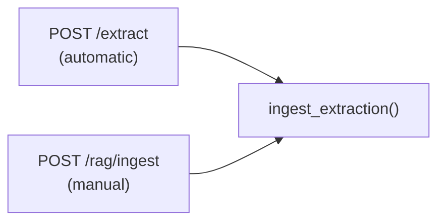
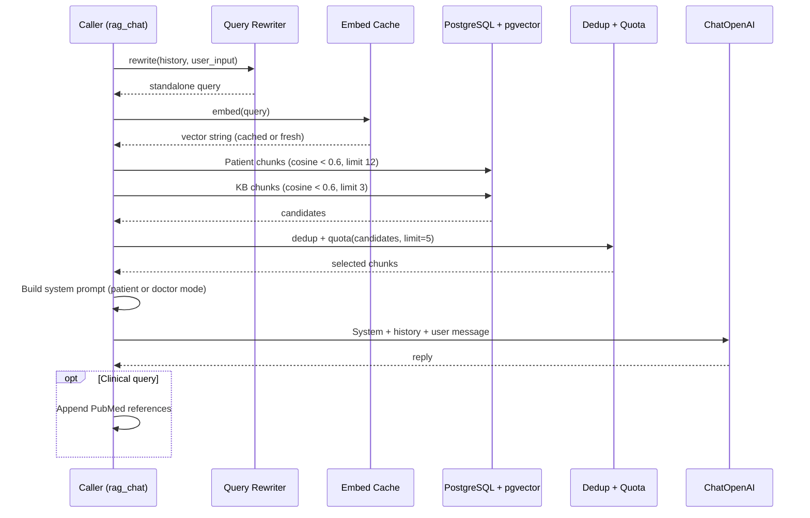

# 06 — RAG Architecture

## Purpose

This document is the definitive reference for the Retrieval-Augmented Generation (RAG) system that powers the clinical chat. It covers the vector store schema, ingestion pipeline, chunking strategy, embedding model, retrieval algorithm, query rewriting, dedup/quota logic, knowledge base management, the HTTP API surface, caching layers, and operational runbooks.

For how RAG integrates into the broader AI pipeline, see `05_AI_PIPELINE.md`. For the `document_chunks` and `knowledge_base_chunks` schema, see `03_DATABASE_SCHEMA.md`.

---

## System Overview

```mermaid
flowchart TD
    subgraph "Ingestion Path"
        EXT["Extraction Pipeline<br/>(/extract)"] --> INGEST["ingest_extraction()"]
        MANUAL["POST /rag/ingest"] --> INGEST
        KB_SEED["seed_kb.py"] --> KB_INGEST["KB INSERT"]
        KB_API["POST /rag/knowledge-base/ingest"] --> KB_INGEST
        
        INGEST --> CHUNK["Chunker<br/>(report_text, biomarker,<br/>biomarker_summary, insight)"]
        CHUNK --> EMBED_I["OpenAI Embed<br/>(batched ≤96)"]
        EMBED_I --> DC["document_chunks<br/>(pgvector)"]
        
        KB_INGEST --> EMBED_K["OpenAI Embed"]
        EMBED_K --> KBC["knowledge_base_chunks<br/>(pgvector)"]
    end
    
    subgraph "Retrieval Path"
        QUERY["User query"] --> REWRITE["Query Rewrite<br/>(LLM, optional)"]
        REWRITE --> EMBED_Q["Embed query<br/>(cached 5 min)"]
        EMBED_Q --> SEARCH_P["Cosine search<br/>document_chunks"]
        EMBED_Q --> SEARCH_K["Cosine search<br/>knowledge_base_chunks"]
        
        SEARCH_P --> DEDUP["Dedup + Quota"]
        DEDUP --> PROMPT["System Prompt<br/>Assembly"]
        SEARCH_K --> PROMPT
        
        PROMPT --> LLM["ChatOpenAI<br/>(temp 0.3)"]
        LLM --> PUBMED["PubMed refs<br/>(conditional)"]
        PUBMED --> REPLY["Response"]
    end
```



---

## Vector Store Schema

### `document_chunks` — Patient-Scoped Data

| Column | Type | Purpose |
| ------ | ---- | ------- |
| `id` | TEXT (UUID) | Primary key, set by Python |
| `patient_id` | TEXT | FK → patients. Mandatory. |
| `upload_id` | TEXT | FK → uploads. Groups chunks by extraction event. |
| `extraction_id` | TEXT | FK → extractions (nullable — see below). |
| `organization_id` | TEXT | FK → organizations. Tenant isolation. |
| `chunk_type` | TEXT | `report_text`, `biomarker_summary`, `biomarker`, `clinical_insight` |
| `chunk_index` | INT | Ordering within a type per extraction. |
| `content` | TEXT | The embedded text. |
| `metadata` | JSONB | Structured metadata for GIN-indexed filtering. |
| `embedding` | vector(1536) | OpenAI `text-embedding-3-small` output. |
| `report_type` | TEXT | Derived slug: `cbc`, `lipid_panel`, `comprehensive_panel`, etc. |
| `report_date` | TIMESTAMP | Collection/report date parsed from raw text. |
| `created_at` | TIMESTAMP | Insertion time. |

**Indexes:**

| Type | Columns | Purpose |
| ---- | ------- | ------- |
| B-tree | `(patient_id, chunk_type)` | Patient-scoped type filtering |
| B-tree | `organization_id` | Tenant isolation |
| B-tree | `report_type` | Panel-type filtering |
| B-tree | `report_date` | Temporal ordering |
| HNSW | `embedding vector_cosine_ops` | Approximate nearest neighbor |
| GIN | `metadata` | JSONB key/value filtering |

### `knowledge_base_chunks` — Global Reference Data

| Column | Type | Purpose |
| ------ | ---- | ------- |
| `id` | TEXT (UUID) | Primary key |
| `topic` | TEXT | Guideline topic (e.g., "Fasting Blood Glucose Guidelines") |
| `content` | TEXT | Guideline text chunk |
| `metadata` | JSONB | `{biomarker, category, chunk_index, chunk_count}` |
| `embedding` | vector(1536) | |
| `created_at` | TIMESTAMP | |

**Indexes:** HNSW on `embedding`, GIN on `metadata`.

> [!IMPORTANT]
> `extraction_id` is always `NULL` during the standard pipeline. The extractions row is created by the API *after* the extraction service returns, so its ID doesn't exist when chunks are ingested. Chunks are keyed by `upload_id` + `patient_id` instead.

---

## Ingestion Pipeline

### Trigger Points



Ingestion runs automatically at the end of every successful extraction (`extract.py`). It also exposes a manual `POST /rag/ingest` endpoint for re-ingestion or backfill.

### Chunk Generation Strategy

For each extraction, the ingester produces four types of chunks:

#### 1. Report Text Chunks

| Parameter | Value |
| --------- | ----- |
| Input | PHI-masked full report text |
| Splitter | `RecursiveCharacterTextSplitter` |
| Chunk size | 500 characters |
| Overlap | 100 characters |
| Separators | `\n\n`, `\n`, `. `, ` ` (priority order) |

Produces N chunks from the masked report text. Each chunk carries `metadata: {source: "report_text"}`.

#### 2. Biomarker Summary (1 per extraction)

Formats all biomarkers into a single block:
```
Biomarker Panel Summary:
- Hemoglobin: 14.2 g/dL — NORMAL (Ref: 12.0 - 17.5 g/dL)
- Glucose: 105 mg/dL — HIGH (Ref: 70 - 99 mg/dL)
```

Metadata includes a compact `biomarkers` array with `{name, status, category}` per marker — enabling metadata-level filtering without parsing the content.

#### 3. Individual Biomarker Chunks (1 per marker)

Each biomarker gets its own chunk:
```
Hemoglobin: 14.2 g/dL — NORMAL (Ref: 12.0 - 17.5 g/dL)
```

Rich metadata per chunk:
```json
{
  "source": "biomarker",
  "biomarker": "hemoglobin",
  "status": "NORMAL",
  "category": "CBC",
  "unit": "g/dL"
}
```

**Design rationale:** Individual biomarker chunks enable granular semantic retrieval. When a user asks "what is my iron level?", the single-marker chunk for ferritin/serum iron scores higher than the full panel summary that mentions 15 markers. GIN-indexed metadata enables future structured queries (e.g., "all HIGH status biomarkers").

#### 4. Clinical Insight Chunks (1 per insight)

```
Clinical Insight: Lipid Panel Within Target
Summary: LDL cholesterol at 95 mg/dL and HDL at 55 mg/dL are both within reference ranges.
Tone: positive
```

Metadata maps `tone` → `risk_level` via a lookup table:

| Tone | Risk Level |
| ---- | ---------- |
| `critical`, `alert` | `high` |
| `warning`, `caution` | `moderate` |
| `neutral`, `info`, `positive`, `good` | `low` |

### Embedding

| Parameter | Value |
| --------- | ----- |
| Model | `text-embedding-3-small` |
| Dimension | 1536 |
| Batch size | ≤ 96 chunks per API call |
| Provider | OpenAI (via LangChain `embed_documents()`) |

Long reports may produce 20+ chunks. Embedding is batched to stay under the API token limit.

### Idempotency

```sql
DELETE FROM "document_chunks" WHERE "upload_id" = %s;
-- then INSERT all new chunks
```

Re-processing an upload deletes all existing chunks for that `upload_id` before re-inserting. This is a `DELETE + INSERT all` pattern rather than upsert, because chunk count changes between extractions (different text splitting, different biomarker count).

### Report Metadata Derivation

**Report date** — Parsed from the **raw** (pre-masking) text via regex. Scans for labeled date patterns in priority order:

| Priority | Label Pattern | Example |
| -------- | ------------- | ------- |
| 1 | `Collection Date` | `Collection Date: 2024-01-15` |
| 2 | `Date Collected` | `Date Collected: Jan 15, 2024` |
| 3 | `Draw Date` | `Draw Date: 15/01/2024` |
| 4 | `Report Date` | `Report Date: 2024-01-15` |
| 5 | `Result Date` | `Result Date: January 15, 2024` |

Supports 12+ date formats (ISO, US, European, month-name variants). Returns `None` if nothing is parseable.

**Report type** — Derived from biomarker categories:
- Single category → its slug (e.g., `cbc`)
- Dominant category (≥ 60%) → that slug
- Mixed → `comprehensive_panel`

### Organization Resolution

`organization_id` is resolved via a SQL subquery at insert time:
```sql
(SELECT "organization_id" FROM "uploads" WHERE "id" = %s)
```

This ensures the chunk inherits the correct tenant scope without the extraction service needing to know the org hierarchy.

---

## Retrieval Pipeline

### Step-by-Step Flow



### Query Rewrite

Resolves anaphora and contextual references in multi-turn conversations:

| Input | History | Rewritten |
| ----- | ------- | --------- |
| "What about my iron?" | Prior discussion of CBC results | "iron studies ferritin serum iron levels" |
| "Is that high?" | Previous message about cholesterol | "is LDL cholesterol 145 mg/dL high" |

**Implementation:** Last 6 conversation turns are formatted as `role: content` text, sent to the LLM with a rewrite prompt. Falls back to raw input on error or when no history exists.

**Toggle:** `ENABLE_QUERY_REWRITE` env var (default: `true`).

### Vector Search

Two parallel queries against pgvector:

**Patient chunks:**
```sql
SELECT id, content, chunk_type, 
       COALESCE(report_date, created_at) AS chunk_date,
       (embedding <=> %s::vector) AS distance
FROM document_chunks
WHERE patient_id = %s
  AND (embedding <=> %s::vector) < 0.6
  AND organization_id = %s          -- tenant isolation
ORDER BY embedding <=> %s::vector,
         COALESCE(report_date, created_at) DESC
LIMIT 12
```

**Knowledge base chunks:**
```sql
SELECT content, topic
FROM knowledge_base_chunks
WHERE (embedding <=> %s::vector) < 0.6
ORDER BY embedding <=> %s::vector
LIMIT 3
```

Both queries use the `<=>` cosine distance operator, which leverages the HNSW index for approximate nearest-neighbor search.

### Dedup and Quota Algorithm

```python
def _dedup_and_quota(candidates, final_limit=5):
```

1. **Normalize:** Collapse whitespace, lowercase, skip empty/duplicate content.
2. **Type quota:** Cap `report_text` chunks at 3 (`REPORT_TEXT_CAP`).
3. **Select:** Take first `final_limit` (5) chunks in relevance order.
4. **Backfill:** If under limit, backfill from capped `report_text` chunks.

**Why this matters:** Without the `report_text` cap, a long report could produce 10+ text chunks that all score similarly, crowding out the biomarker and insight chunks that contain the most semantically useful structured data.

### Embedding Cache

| Parameter | Value |
| --------- | ----- |
| Key | Raw query string |
| Value | `(timestamp, pgvector_literal_string)` |
| TTL | 5 minutes |
| Max size | 512 entries |
| Eviction | Full cache clear on overflow |

Prevents re-embedding the same query within a session. The cache stores the formatted pgvector literal (`[0.1,0.2,...]`) rather than the raw vector array, avoiding re-serialization.

### Context Window Assembly

Three data blocks are injected into the system prompt:

```
--- BEGIN PATIENT_HISTORY (untrusted data) ---
[biomarker | 2024-01-15] Hemoglobin: 14.2 g/dL — NORMAL (Ref: 12.0 - 17.5)
[clinical_insight | 2024-01-15] Clinical Insight: CBC Within Range
--- END PATIENT_HISTORY ---

--- BEGIN REFERENCE_GUIDELINES (untrusted data) ---
Topic: Fasting Blood Glucose Guidelines
Fasting blood glucose measures the concentration of glucose...
--- END REFERENCE_GUIDELINES ---

--- BEGIN CURRENT_PANEL (untrusted data) ---
- Hemoglobin: 14.2 g/dL — NORMAL (Ref: 12.0 - 17.5 g/dL)
--- END CURRENT_PANEL ---
```

**Patient chunks** are formatted as `[chunk_type | date] content`. Date is `report_date` if available, falling back to `created_at`.

**Current panel** is formatted from the request's `biomarkers` array (the active session's data, not retrieved from the store). Uses a shared `format_biomarker_line()` utility that coalesces snake_case and camelCase field names.

---

## Knowledge Base Management

### Seed Script

```bash
python seed_kb.py
```

Clears all existing KB chunks and re-inserts from the hardcoded `BIOMARKER_GUIDELINES` list. Currently defines 5 clinical guideline topics:

| Topic | Biomarker | Category |
| ----- | --------- | -------- |
| Fasting Blood Glucose Guidelines | GLUCOSE | metabolic |
| Total Cholesterol and Lipid Panels | CHOLESTEROL_TOTAL | lipids |
| HDL Cholesterol (Good Cholesterol) | CHOLESTEROL_HDL | lipids |
| LDL Cholesterol (Bad Cholesterol) | CHOLESTEROL_LDL | lipids |
| Hemoglobin A1c (HbA1c) Guidelines | HBA1C | metabolic |

Each guideline is split via `split_text()` (800 chars, 100 overlap) and embedded independently. Metadata includes `biomarker`, `category`, `chunk_index`, and `chunk_count`.

### Runtime KB Ingestion

```
POST /rag/knowledge-base/ingest
{
  "topic": "Vitamin D Deficiency",
  "content": "Vitamin D is essential for calcium absorption...",
  "metadata": {"biomarker": "VITAMIN_D", "category": "vitamins"}
}
```

Returns `{success: true, chunks_created: N, chunk_id: "uuid"}`. Content is split and embedded the same way as the seed script. Does **not** deduplicate — multiple calls create additional chunks.

---

## HTTP API Surface

### Endpoints

| Method | Path | Purpose | Auth |
| ------ | ---- | ------- | ---- |
| `POST` | `/rag/chat` | RAG-grounded clinical chat | X-Service-Secret |
| `POST` | `/rag/ingest` | Manual patient chunk ingestion | X-Service-Secret |
| `POST` | `/rag/knowledge-base/ingest` | Add KB guideline | X-Service-Secret |
| `GET` | `/rag/health` | Database connectivity check | None |

### `/rag/chat` Request

```json
{
  "patient_id": "uuid",
  "messages": [{"role": "user", "content": "What is my hemoglobin?"}],
  "user_input": "What is my hemoglobin?",
  "biomarkers": [{"displayName": "Hemoglobin", "value": 14.2, "unit": "g/dL", "referenceRange": "12.0 - 17.5", "status": "NORMAL"}],
  "user_role": "patient",
  "organization_id": "uuid"
}
```

### `/rag/chat` Response

```json
{
  "reply": "Your hemoglobin level is 14.2 g/dL, which falls within the normal...",
  "provider": "openai"
}
```

### API-Side Client

The Node.js API service calls RAG via `ragService.ts`:
- Base URL: `env.EXTRACTION_SERVICE_URL + "/rag"`
- Timeout: `env.EXTRACTION_SERVICE_TIMEOUT_MS` (default 60s)
- Auth: `X-Service-Secret` header
- Errors wrapped in `RagServiceError` with HTTP status

---

## Connection Architecture

### Database

| Component | Library | Pool | Purpose |
| --------- | ------- | ---- | ------- |
| RAG queries | `psycopg` + `psycopg_pool` | Min 1, max 10 | All vector search + ingestion |
| Row format | `dict_row` | — | Returns dicts instead of tuples |

The pool is a lazy singleton (`_get_pool()`). Blocking SQL queries are wrapped in `asyncio.to_thread()` to avoid stalling the FastAPI event loop.

### LLM / Embeddings

| Singleton | Library | Model | Purpose |
| --------- | ------- | ----- | ------- |
| `get_chat_model()` | LangChain `ChatOpenAI` | `gpt-4o-mini` (configurable) | Query rewrite, chat generation |
| `get_openai_embeddings()` | LangChain `OpenAIEmbeddings` | `text-embedding-3-small` | All embedding operations |

Both initialized on first call, reused for the process lifetime.

---

## Tenant Isolation

RAG enforces two layers of data isolation:

1. **Ingestion:** `organization_id` is resolved from the upload record and stored on every `document_chunks` row.
2. **Retrieval:** Patient chunk queries filter by **both** `patient_id` AND `organization_id`:

```sql
WHERE "patient_id" = %s
  AND (embedding <=> %s::vector) < %s
  AND "organization_id" = %s
```

Even if a `patient_id` UUID is guessed or leaked, the `organization_id` filter prevents cross-tenant data access.

Knowledge base chunks are **global** (not tenant-scoped) — they contain general clinical guidelines applicable to all organizations.

---

## Startup Validation

`config.py` → `validate_embedding_dim()` performs a safety check at startup:

| Check | Action |
| ----- | ------ |
| Known model, dimension matches pgvector column | Pass |
| Known model, dimension mismatches pgvector column | **Raise `ValueError`** — prevents silent insert failures |
| Unknown model | Warning log (can't verify) |

Known model dimensions:

| Model | Dimension |
| ----- | --------- |
| `text-embedding-3-small` | 1536 |
| `text-embedding-3-large` | 3072 |
| `text-embedding-ada-002` | 1536 |

---

## Caching Summary

| Cache | Location | TTL | Max Size | Key | Eviction |
| ----- | -------- | --- | -------- | --- | -------- |
| Query embeddings | In-memory dict | 5 min | 512 entries | Raw query string | Full clear |
| PubMed references | In-memory dict | 1 hour | Unbounded | Cleaned search term | None (low cardinality) |

---

## Configuration Reference

| Variable | Default | Purpose |
| -------- | ------- | ------- |
| `OPENAI_API_KEY` | — | All LLM + embedding calls |
| `LLM_MODEL` | `gpt-4o-mini` | RAG chat and query rewrite model |
| `EMBEDDING_MODEL` | `text-embedding-3-small` | Embedding model |
| `EMBEDDING_DIMENSION` | `1536` | Must match pgvector column |
| `SUPABASE_DB_URL` | — | Direct PostgreSQL connection for pgvector |
| `RAG_MAX_DISTANCE` | `0.6` | Cosine distance threshold for retrieval |
| `ENABLE_QUERY_REWRITE` | `true` | Toggle multi-turn query rewriting |
| `ENABLE_PUBMED` | `true` | Toggle PubMed reference enrichment |
| `NCBI_API_KEY` | — | Optional: bypass NCBI rate limits |
| `RAG_DEBUG` | `false` | Verbose retrieval logging (candidate scores, selected chunks) |

---

## Operational Runbook

### Re-seed Knowledge Base

```bash
cd apps/extraction
python seed_kb.py
```

This clears and re-inserts all KB chunks. Required after the migration `20260618` data loss event or after updating guideline content.

### Re-ingest a Patient's Data

Call the manual ingestion endpoint:
```bash
curl -X POST http://localhost:8000/rag/ingest \
  -H "Content-Type: application/json" \
  -d '{"patient_id": "...", "upload_id": "...", "masked_text": "...", "biomarkers": [...], "insights": [...]}'
```

Or re-process the upload through the standard pipeline — the `DELETE + INSERT` idempotency ensures clean re-ingestion.

### Debug Retrieval Quality

Set `RAG_DEBUG=true` to enable verbose logging:
```
RAG retrieval patient=abc org=xyz: 8 candidates -> 5 selected |
candidates=[(id[:8], chunk_type, distance), ...] |
selected=[(id[:8], chunk_type), ...] |
kb=2
```

### Health Check

```bash
curl http://localhost:8000/rag/health
# {"status": "online", "database": "healthy", "provider": "openai"}
```

---

## Related Documents

| Document | Relevance |
| -------- | --------- |
| `03_DATABASE_SCHEMA.md` | `document_chunks` and `knowledge_base_chunks` full schema |
| `04_EXTRACTION_PIPELINE.md` | How ingestion is triggered from the extraction pipeline |
| `05_AI_PIPELINE.md` | How RAG chat fits into the multi-provider fallback chain |

---

### Revision History

| Date       | Change |
| ---------- | ------ |
| 2026-07-02 | Initial document generated from full RAG codebase audit. |
