# 09 — Feature Roadmap

## Purpose

This document maps the full feature landscape of the HealthLab platform — what is shipped, what is partially built, and what is planned. Features are grouped by domain, tagged with a maturity status, and prioritized into execution phases. The roadmap is derived from the codebase audit, the strategic product plan (`future-steps.md`), and the pending decisions in `08_DECISION_LOG.md`.

---

## Status Legend

| Status | Meaning |
| ------ | ------- |
| ✅ **Shipped** | Feature is implemented, tested in dev, and functional |
| 🔧 **Built, not wired** | Infrastructure exists but is disabled or partially integrated |
| 📐 **Designed** | Schema / interfaces exist but implementation is incomplete |
| 🗓️ **Planned** | Agreed upon, not yet started |
| 💡 **Proposed** | Under consideration, no commitment |

---

## Current Feature Inventory

### 1. PDF Extraction Pipeline

| Feature | Status | Notes |
| ------- | ------ | ----- |
| PyMuPDF text extraction | ✅ Shipped | Primary fast-path extractor |
| pdfplumber table extraction | ✅ Shipped | Secondary layout-aware extractor |
| Mistral OCR fallback | ✅ Shipped | Handles scanned/image PDFs |
| PDF classification (text vs image) | ✅ Shipped | 50-char threshold routing |
| Parallel-then-best candidate selection | ✅ Shipped | Quality-driven extractor comparison |
| Composite quality scoring | ✅ Shipped | 10 panels, weighted coverage |
| Automated OCR escalation | ✅ Shipped | Triggers when confidence < 0.90 or biomarker sets conflict |

### 2. Biomarker Processing

| Feature | Status | Notes |
| ------- | ------ | ----- |
| LLM biomarker extraction (Structured Outputs) | ✅ Shipped | `gpt-4o-mini`, strict JSON schema |
| Canonical biomarker dictionary (~60 markers) | ✅ Shipped | Hardcoded Python module |
| 5-strategy name resolution cascade | ✅ Shipped | Exact → suffix → abbreviation → token-set → fuzzy |
| Unit conversion engine | ✅ Shipped | Converts to preferred units per biomarker |
| Status classification (LOW/NORMAL/HIGH/CRITICAL) | ✅ Shipped | Against reference ranges |
| LLM clinical insight generation | ✅ Shipped | 2–4 insights per extraction |
| Dictionary expansion to 200+ markers | 🗓️ Planned | Phase 3 — requires admin UI |

### 3. PHI Protection

| Feature | Status | Notes |
| ------- | ------ | ----- |
| Presidio NER detection (12 entity types) | ✅ Shipped | spaCy `en_core_web_sm` |
| Regex fallback (12 patterns) | ✅ Shipped | MRN, DOB, SSN, Aadhaar, phone, email, etc. |
| Deterministic token vault | ✅ Shipped | SHA-256 hashed, cross-page consistent |
| Medical whitelist (40+ terms) | ✅ Shipped | Prevents false positives on clinical terms |
| PHI-before-LLM enforcement | ✅ Shipped | Structural code-level guarantee |

### 4. RAG Clinical Chat

| Feature | Status | Notes |
| ------- | ------ | ----- |
| Document chunk ingestion (4 types) | ✅ Shipped | report_text, biomarker_summary, biomarker, insight |
| pgvector cosine search (HNSW) | ✅ Shipped | Patient + KB dual-search |
| Query rewrite (multi-turn) | ✅ Shipped | LLM-based pronoun/reference resolution |
| Dedup + quota algorithm | ✅ Shipped | report_text cap at 3, final limit 5 |
| Embedding cache (5-min TTL) | ✅ Shipped | In-memory, 512 entry max |
| PubMed reference enrichment | ✅ Shipped | NCBI eUtils, 1-hour cache |
| Prompt injection defense (fenced blocks) | ✅ Shipped | Labeled untrusted data sections |
| Knowledge base seeding (5 topics) | ✅ Shipped | Glucose, cholesterol (total/HDL/LDL), HbA1c |
| Runtime KB ingestion endpoint | ✅ Shipped | `POST /rag/knowledge-base/ingest` |
| Dual-mode system prompts (patient/doctor) | ✅ Shipped | Role-specific clinical language |
| Streaming chat responses | 🗓️ Planned | SSE/WebSocket for reduced perceived latency |

### 5. Multi-Provider Chat

| Feature | Status | Notes |
| ------- | ------ | ----- |
| RAG-grounded chat (OpenAI via Python) | ✅ Shipped | Primary path |
| Gemini fallback (`gemini-1.5-flash`) | ✅ Shipped | First fallback |
| OpenAI direct fallback (`gpt-4o-mini`) | ✅ Shipped | Second fallback |
| Mistral fallback (`mistral-medium-latest`) | ✅ Shipped | Third fallback |
| Typed ProviderError codes | ✅ Shipped | QUOTA_EXCEEDED, SERVICE_UNAVAILABLE, NOT_CONFIGURED |
| Chat session management | ✅ Shipped | Multi-session, auto-titling, 12-message history cap |

### 6. Authentication & Authorization

| Feature | Status | Notes |
| ------- | ------ | ----- |
| Supabase JWT verification (Passport) | ✅ Shipped | HS256, auto-detect Base64 secret |
| Auto-provision staff on first JWT | ✅ Shipped | Creates User with role USER |
| requireAuth middleware | ✅ Shipped | All protected routes |
| requireAccountType guard | ✅ Shipped | STAFF / PATIENT separation |
| requireRole guard | ✅ Shipped | ADMIN, DOCTOR, USER |
| Dev bypass mode (BYPASS_AUTH) | 🔧 Built, not wired | Must set `false` for production |
| Supabase Auth production integration | 📐 Designed | JWT strategy ready, needs real Supabase project |

### 7. Multi-Tenancy

| Feature | Status | Notes |
| ------- | ------ | ----- |
| Organization model + scoped queries | ✅ Shipped | All data filtered by organizationId |
| Organization branding (colors, logos) | ✅ Shipped | 7-tone HSL palette, 4 logo variants |
| Branding admin UI | ✅ Shipped | `BrandingAdmin.tsx` with live preview |
| API branding cache (5-min TTL) | ✅ Shipped | Per-tenant CSS variable injection |
| Organization plan tiers (FREE/PRO/ENTERPRISE) | 📐 Designed | Schema exists, no feature gating logic |
| Branded PDF export | ✅ Shipped | Dynamic colors in `PremiumPDFDocument.tsx` |

### 8. Clinician Portal

| Feature | Status | Notes |
| ------- | ------ | ----- |
| Patient directory (search, onboard, edit) | ✅ Shipped | `ClinicianDashboard.tsx` |
| Patient onboarding modal | ✅ Shipped | Supabase account creation |
| Reports tab (status, view, delete) | ✅ Shipped | Per-patient report history |
| Trends tab (Recharts time-series) | ✅ Shipped | Reference-range shading |
| Compare tab (delta analysis) | ✅ Shipped | Improved / worsened / stable / new / resolved |
| Insights tab (AI summaries) | ✅ Shipped | Health score + flagged highlights |
| Appointments widget | ✅ Shipped | CRUD, color-coded status |
| Task management widget | ✅ Shipped | Priority, status, filters |

### 9. Patient Dashboard

| Feature | Status | Notes |
| ------- | ------ | ----- |
| Demographics card | ✅ Shipped | Name, email, age, gender |
| Health statistics cards | ✅ Shipped | Normal vs flagged counts |
| Wellness index score (0–100) | ✅ Shipped | Computed from biomarker status ratios |
| Report history table | ✅ Shipped | Download PDF, open analysis |
| AI chat interface | ✅ Shipped | Multi-session, markdown rendering |

### 10. Analysis Workspaces

| Feature | Status | Notes |
| ------- | ------ | ----- |
| Biomarker grid (category filtering) | ✅ Shipped | Flagged-only toggle |
| Reference-range sliders | ✅ Shipped | Multi-color visual indicators |
| Biomarker detail sidebar | ✅ Shipped | Definitions, significance, dietary tips |
| Drag-and-drop report comparison | ✅ Shipped | Percentage delta calculation |

### 11. Export & Reporting

| Feature | Status | Notes |
| ------- | ------ | ----- |
| Client-side branded PDF (`@react-pdf/renderer`) | ✅ Shipped | `PremiumPDFDocument.tsx` |
| Server-side report generation (narrative) | ✅ Shipped | GPT summary with static fallback |
| PDF upload to Supabase Storage | ✅ Shipped | `reports/{patientId}/{uploadId}.pdf` |
| ReportExport audit trail | ✅ Shipped | Tracks who generated what |
| CSV biomarker export | ✅ Shipped | Raw data download |

### 12. Platform UX

| Feature | Status | Notes |
| ------- | ------ | ----- |
| Light / dark / system theme toggle | ✅ Shipped | CSS custom properties + OS detection |
| Driver.js guided tour (7 steps) | ✅ Shipped | Completion persisted in localStorage |
| Welcome modal (first login) | ✅ Shipped | Tour prompt or sample report |
| Floating help drawer | ✅ Shipped | Platform steps, panels, privacy, FAQs |
| Interactive guide playground | ✅ Shipped | `Guide.tsx` — upload, sliders, trends, chat simulators |

### 13. Infrastructure

| Feature | Status | Notes |
| ------- | ------ | ----- |
| Docker Compose (full stack) | ✅ Shipped | Redis, extraction, API, web |
| Turborepo build orchestration | ✅ Shipped | pnpm workspaces |
| Zod environment validation | ✅ Shipped | Startup crash on missing vars |
| Embedding dimension guard | ✅ Shipped | Startup validation against pgvector schema |
| Helmet security headers | ✅ Shipped | Default strict headers |
| Morgan request logging | ✅ Shipped | `combined` in prod, `dev` locally |
| BullMQ queue system | 🔧 Built, not wired | Code complete, imports commented out |
| Rate limiting | 🗓️ Planned | Required before public launch |
| CI/CD pipeline | 🗓️ Planned | No automated testing/deployment pipeline |
| End-to-end test suite | 🗓️ Planned | Individual service tests only |

---

## Execution Phases

### Phase 1 — Production Hardening (Pre-Launch)

> [!IMPORTANT]
> These items must be completed before any production deployment.

| # | Item | Effort | Depends On | Ref |
| - | ---- | ------ | ---------- | --- |
| 1.1 | Disable `BYPASS_AUTH`, wire Supabase Auth | S | Supabase project | D-015 |
| 1.2 | Restrict CORS to `env.CORS_ORIGIN` | XS | — | D-014 |
| 1.3 | Add `express-rate-limit` on LLM endpoints | S | — | `07_SECURITY.md` Gap #3 |
| 1.4 | Re-enable BullMQ queue system | M | Redis infrastructure | D-005 |
| 1.5 | Implement signed URLs for PDF downloads | S | — | `07_SECURITY.md` Gap #4 |
| 1.6 | End-to-end pipeline test suite | L | Stable API contract | — |
| 1.7 | CI/CD pipeline (lint, test, build, deploy) | M | Test suite | — |

### Phase 2 — User Engagement & Retention

Competitive features benchmarked against SiPhox Health and Docus.ai.

| # | Item | Effort | Value |
| - | ---- | ------ | ----- |
| 2.1 | **Personalized action plans** — daily lifestyle recommendations from biomarker data (morning/noon/evening) | L | Patient engagement + retention |
| 2.2 | **Shareable reports** — token-gated public links without requiring recipient accounts | M | Care coordination, second opinions |
| 2.3 | **Visual upload timeline** — interactive chart of report history with trend access | M | UX improvement over linear list |
| 2.4 | **In-depth test information modals** — clinical significance, affecting factors | M | Health literacy, reduced clinician burden |
| 2.5 | **Streaming chat responses** — SSE/WebSocket for token-by-token delivery | M | Perceived latency reduction |

### Phase 3 — Clinical Workflow & Global Reach

| # | Item | Effort | Value |
| - | ---- | ------ | ----- |
| 3.1 | **Multilingual reports + UI** — 80+ language support via LLM translation + i18n framework | XL | International market expansion |
| 3.2 | **Agentic follow-up tasks** — auto-generate prioritized clinical tasks from flagged biomarkers | L | Clinical co-pilot, missed follow-up reduction |
| 3.3 | **Audit log compliance UI** — searchable dashboard with CSV export | M | Enterprise compliance requirement |
| 3.4 | **Biomarker dictionary expansion** (60 → 200+) — database-backed admin registry | L | Clinical utility + specialist appeal |
| 3.5 | **Biological age score** — scientific model beyond current wellness index | M | Consumer engagement, shareable metric |

### Phase 4 — Enterprise Scalability

| # | Item | Effort | Value |
| - | ---- | ------ | ----- |
| 4.1 | **HL7/FHIR R4 adapter** — ingest HL7 v2.x from LIS, output FHIR R4 | XL | Enterprise adoption gateway |
| 4.2 | **Mutual TLS** for service-to-service auth — replace shared secret | L | Security + secret rotation |
| 4.3 | **Organization plan feature gating** — enforce FREE/PRO/ENTERPRISE limits | M | Monetization |
| 4.4 | **Multi-region deployment** — replicated infrastructure for compliance | XL | Regulatory (data residency) |

---

## Effort Sizing

| Label | Meaning |
| ----- | ------- |
| **XS** | < 1 day, config change or one-liner |
| **S** | 1–3 days, single module |
| **M** | 1–2 weeks, multi-module |
| **L** | 2–4 weeks, cross-service |
| **XL** | 1–2 months, architectural |

---

## Feature Dependency Graph

```mermaid
flowchart TD
    subgraph "Phase 1 — Pre-Launch"
        AUTH["1.1 Wire Supabase Auth"]
        CORS["1.2 CORS lockdown"]
        RATE["1.3 Rate limiting"]
        QUEUE["1.4 Re-enable BullMQ"]
        SIGNED["1.5 Signed URLs"]
        TESTS["1.6 E2E test suite"]
        CICD["1.7 CI/CD pipeline"]
    end
    
    subgraph "Phase 2 — Engagement"
        ACTIONS["2.1 Action plans"]
        SHARE["2.2 Shareable reports"]
        TIMELINE["2.3 Upload timeline"]
        TESTINFO["2.4 Test info modals"]
        STREAM["2.5 Streaming chat"]
    end
    
    subgraph "Phase 3 — Clinical"
        I18N["3.1 Multilingual"]
        AGENT["3.2 Agentic tasks"]
        AUDIT_UI["3.3 Audit log UI"]
        DICT["3.4 Dictionary 200+"]
        BIOAGE["3.5 Biological age"]
    end
    
    subgraph "Phase 4 — Enterprise"
        HL7["4.1 HL7/FHIR adapter"]
        MTLS["4.2 Mutual TLS"]
        PLANS["4.3 Plan feature gating"]
        MULTI_REGION["4.4 Multi-region"]
    end
    
    AUTH --> TESTS
    TESTS --> CICD
    QUEUE --> TESTS
    
    SIGNED --> SHARE
    DICT --> BIOAGE
    DICT --> AGENT
    AUTH --> AUDIT_UI
    
    PLANS --> MULTI_REGION
    AUTH --> HL7
```

---

## Competitive Benchmark

| Feature | HealthLab | SiPhox Health | Docus.ai |
| ------- | --------- | ------------- | -------- |
| PDF extraction + OCR | ✅ 3 extractors | ❌ No PDF upload | ✅ |
| Biomarker normalization | ✅ 5-strategy cascade | ✅ | ✅ |
| RAG clinical chat | ✅ Multi-provider | ❌ | ✅ |
| PubMed citations | ✅ | ❌ | ❌ |
| Patient action plans | 🗓️ | ✅ | ❌ |
| Shareable reports | 🗓️ | ✅ | ❌ |
| Multi-language | 🗓️ | ❌ | ✅ 80+ |
| HL7/FHIR | 🗓️ | ❌ | ✅ |
| Agentic task gen | 🗓️ | ❌ | ❌ |
| Biological age score | 🗓️ | ✅ | ❌ |
| Audit log UI | 🗓️ | ❌ | ✅ |
| Multi-tenant branding | ✅ | ❌ | ❌ |
| PHI masking (pre-LLM) | ✅ | N/A | ❓ |

---

## Related Documents

| Document | Relevance |
| -------- | --------- |
| `00_PROJECT_OVERVIEW.md` | System context and tech stack |
| `07_SECURITY.md` | Production checklist (8 gaps) feeds Phase 1 |
| `08_DECISION_LOG.md` | Pending decisions (5 items) feed Phase 2–4 |

---

### Revision History

| Date       | Change |
| ---------- | ------ |
| 2026-07-03 | Initial document — feature inventory + 4-phase roadmap from codebase audit and `future-steps.md`. |
