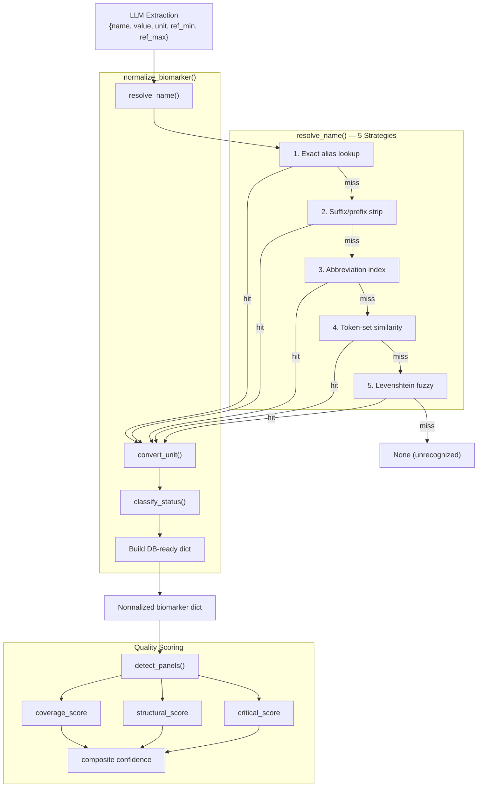
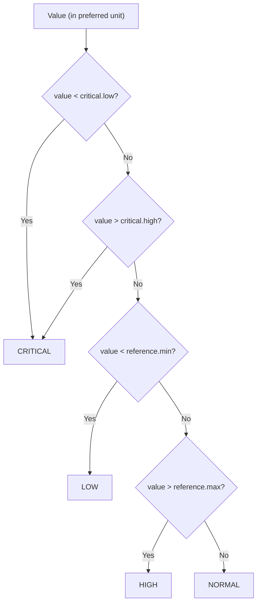

# 12 — Biomarker Normalization

## Purpose

This document is the definitive reference for the biomarker normalization subsystem — the engine that transforms free-form LLM-extracted biomarker strings into structured, canonical, clinically-classified records. It covers the canonical dictionary, the 5-strategy name resolution cascade, unit conversion, status classification, quality scoring, and the panel detection logic that drives OCR escalation decisions.

---

## Normalization Pipeline Overview



---

## 1. Canonical Dictionary

**File:** [dictionary.py](file:///home/Code/DBT/report-viewer/apps/extraction/app/parsers/dictionary.py)
**Size:** 714 lines, 55 biomarker entries

### Structure

Each entry in `BIOMARKER_DICTIONARY` has this shape:

```python
"hemoglobin": {
    "display_name": "Hemoglobin",
    "category": "CBC",
    "aliases": ["hemoglobin", "hgb", "hb", "haemoglobin"],
    "preferred_unit": "g/dL",
    "unit_conversions": {"g/L": lambda v: v / 10},
    "reference": {"min": 12.0, "max": 17.5, "range_str": "12.0 - 17.5 g/dL"},
    "critical": {"low": 7.0, "high": 20.0},
}
```

| Field | Type | Purpose |
| ----- | ---- | ------- |
| `display_name` | string | Human-readable label for UI |
| `category` | string | Panel grouping (CBC, Lipid Panel, etc.) |
| `aliases` | string[] | All known names for exact matching |
| `abbreviations` | string[] | Uppercase short forms (optional, some entries) |
| `preferred_unit` | string | Target unit after conversion |
| `unit_conversions` | dict[str, callable] | Input unit → conversion lambda |
| `reference` | dict | `{min, max, range_str}` — normal range |
| `critical` | dict | `{low, high}` — critical thresholds (nullable) |

### Supported Categories

| Category | Count | Examples |
| -------- | ----- | ------- |
| **Diabetes** | 4 | HbA1c, Glucose, Fasting Glucose, Random Glucose, Fasting Insulin |
| **Lipid Panel** | 7 | Total Cholesterol, LDL, HDL, Triglycerides, VLDL, ApoB, Lp(a), Chol/HDL Ratio |
| **CBC** | 9 | Hemoglobin, WBC, RBC, Platelets, Hematocrit, MCV, MCH, MCHC, RDW, MPV |
| **Liver** | 10 | ALT, AST, Bilirubin (total/direct), Albumin, ALP, GGT, LDH, Total Protein, Globulin, A/G Ratio |
| **Kidney** | 5 | Creatinine, BUN, eGFR, Uric Acid, BUN/Creatinine Ratio |
| **Thyroid** | 5 | TSH, T3, T4, Free T4, Free T3 |
| **Electrolytes** | 7 | Sodium, Potassium, Calcium, Chloride, Magnesium, Phosphorus, CO₂ |
| **Iron Studies** | 2 | Iron, Ferritin |
| **Vitamins** | 3 | Vitamin D, Vitamin B12, Folate |
| **Inflammation** | 2 | CRP, ESR |
| **Hormones** | 4 | Total Testosterone, Free Testosterone, Bioavailable Testosterone, SHBG |
| **Pancreatic** | 2 | Amylase, Lipase |
| **Cardiac** | 1 | Creatine Kinase |

### Derived Indexes

Three lookup structures are built at import time from `BIOMARKER_DICTIONARY`:

| Index | Builder | Key | Value | Purpose |
| ----- | ------- | --- | ----- | ------- |
| `ALIAS_INDEX` | `build_alias_index()` | Cleaned lowercase alias | Canonical name | Strategy 1 (exact) + Strategy 2 (suffix strip) |
| `ABBREVIATION_INDEX` | `build_abbreviation_index()` | Uppercase abbreviation | Canonical name | Strategy 3 (abbreviation) |
| `ALIAS_CANDIDATES` | `build_alias_candidates()` | Canonical name | Alias list | Strategy 4 (token set) + Strategy 5 (fuzzy) |

---

## 2. Name Resolution Cascade

**File:** [normalizer.py L44-L161](file:///home/Code/DBT/report-viewer/apps/extraction/app/parsers/normalizer.py#L44-L161)

### Strategy 1 — Exact Alias Lookup

**Confidence:** `1.00` | **Method:** `exact`

The raw name is cleaned (lowercase, strip punctuation, normalize whitespace) and looked up in `ALIAS_INDEX`.

```
Input:  "Hemoglobin"
Clean:  "hemoglobin"
Lookup: ALIAS_INDEX["hemoglobin"] → "hemoglobin"
Result: ResolvedName(canonical="hemoglobin", confidence=1.0, method="exact")
```

### Strategy 2 — Suffix/Prefix Strip

**Confidence:** `0.95` | **Method:** `suffix_strip`

Strips common noise suffixes and retries the exact lookup:

| Suffix stripped |
| --------------- |
| `" level"` |
| `" levels"` |
| `" test"` |
| `" serum"` |
| `" plasma"` |
| `" blood"` |
| `" total"` |
| `" count"` |

```
Input:  "Hemoglobin Level"
Clean:  "hemoglobin level"
Strip:  "hemoglobin"
Lookup: ALIAS_INDEX["hemoglobin"] → "hemoglobin"
Result: ResolvedName(canonical="hemoglobin", confidence=0.95, method="suffix_strip")
```

### Strategy 3 — Abbreviation Index

**Confidence:** `0.88–0.90` | **Method:** `abbreviation`

The raw name (case-preserved) is uppercased and looked up in `ABBREVIATION_INDEX`. If no match, noise words (`TEST`, `LEVEL`, `SERUM`, `BLOOD`, `PLASMA`) are stripped and retried.

```
Input:  "SGPT"
Upper:  "SGPT"
Lookup: ABBREVIATION_INDEX["SGPT"] → "alt"
Result: ResolvedName(canonical="alt", confidence=0.90, method="abbreviation")
```

**With noise stripping:**
```
Input:  "FBS TEST"
Upper:  "FBS TEST"
Strip:  "FBS"
Lookup: ABBREVIATION_INDEX["FBS"] → "fasting_glucose"
Result: confidence=0.88 (slightly lower due to extra step)
```

### Strategy 4 — Token-Set Similarity

**Confidence:** `≤ 0.85` (formula: `min(0.85, 0.6 + score × 0.25)`) | **Method:** `token_set`
**Threshold:** Jaccard score ≥ `0.65`

The cleaned name is tokenized (split on non-alphanumeric, dedup, sort) and compared against every alias using Jaccard set overlap.

```
Token-set score = |intersection| / |union|
```

**Example:**
```
Input:    "fasting blood glucose level"
Tokens:   {"blood", "fasting", "glucose", "level"}
Candidate: "fasting blood sugar"
Tokens:   {"blood", "fasting", "sugar"}
Intersection: {"blood", "fasting"}
Union:        {"blood", "fasting", "glucose", "level", "sugar"}
Score:    2/5 = 0.40  (below threshold, no match)

Candidate: "fasting glucose"
Tokens:   {"fasting", "glucose"}
Intersection: {"fasting", "glucose"}
Union:        {"blood", "fasting", "glucose", "level"}
Score:    2/4 = 0.50  (below threshold)
```

> [!NOTE]
> Token-set similarity handles word-order differences well (`"glucose fasting"` vs `"fasting glucose"`) but struggles with very short names where a single extra token drops the Jaccard score below threshold.

### Strategy 5 — Levenshtein Fuzzy Match

**Confidence:** `≤ 0.80` (formula: `min(0.80, 0.5 + score × 0.3)`) | **Method:** `fuzzy`
**Threshold:** Levenshtein ratio ≥ `0.75`

Pure-Python single-row DP implementation. Compares the cleaned name against every canonical key and alias.

```
Levenshtein ratio = 1 - (edit_distance / max(len(a), len(b)))
```

**Example:**
```
Input:     "haemoglobin"
Candidate: "hemoglobin"
Distance:  1 (one character insertion)
Ratio:     1 - (1/11) = 0.909
Result:    ResolvedName(canonical="hemoglobin", confidence=0.773, method="fuzzy")
```

### Resolution Summary Table

| # | Strategy | Confidence | Input | Comparison Target | Algorithm |
| - | -------- | ---------- | ----- | ----------------- | --------- |
| 1 | Exact | 1.00 | cleaned name | `ALIAS_INDEX` keys | Direct dict lookup |
| 2 | Suffix strip | 0.95 | cleaned − suffix | `ALIAS_INDEX` keys | Dict lookup after strip |
| 3 | Abbreviation | 0.88–0.90 | raw UPPERCASE | `ABBREVIATION_INDEX` keys | Direct + noise strip |
| 4 | Token-set | ≤ 0.85 | cleaned tokens | All aliases (per canonical) | Jaccard similarity |
| 5 | Fuzzy | ≤ 0.80 | cleaned string | All aliases (per canonical) | Levenshtein ratio |

---

## 3. Unit Conversion

**File:** [normalizer.py L164-L187](file:///home/Code/DBT/report-viewer/apps/extraction/app/parsers/normalizer.py#L164-L187)

Each dictionary entry defines `unit_conversions` — a map of input unit → lambda converter:

```python
"unit_conversions": {"mmol/L": lambda v: v * 18.0182}  # glucose
```

### Conversion Examples

| Biomarker | Input Unit | Formula | Preferred Unit |
| --------- | ---------- | ------- | -------------- |
| Glucose | mmol/L | `v × 18.0182` | mg/dL |
| Hemoglobin | g/L | `v / 10` | g/dL |
| Bilirubin | µmol/L | `v / 17.1` | mg/dL |
| Creatinine | µmol/L | `v / 88.42` | mg/dL |
| HbA1c | mmol/mol | `(v × 0.0915) + 2.15` | % |
| Cholesterol (all) | mmol/L | `v × 38.67` | mg/dL |
| Triglycerides | mmol/L | `v × 88.57` | mg/dL |
| Calcium | mmol/L | `v × 4.0` | mg/dL |
| Hematocrit | L/L | `v × 100` | % |
| Testosterone | nmol/L | `v × 28.843` | ng/dL |

**Behavior when no converter exists:** The value and unit are returned unchanged with a warning log.

---

## 4. Status Classification

**File:** [normalizer.py L190-L217](file:///home/Code/DBT/report-viewer/apps/extraction/app/parsers/normalizer.py#L190-L217)



### Classification Rules

1. **CRITICAL** — value below `critical.low` or above `critical.high`
2. **LOW** — value below `reference.min` (but not critical)
3. **HIGH** — value above `reference.max` (but not critical)
4. **NORMAL** — within `[reference.min, reference.max]`

### Reference Range Priority

PDF-extracted reference ranges (`pdf_ref_min`, `pdf_ref_max`) take precedence over dictionary defaults. This handles lab-specific ranges that differ from the dictionary's population norms.

```python
ref_min = pdf_ref_min if pdf_ref_min is not None else ref.get("min")
ref_max = pdf_ref_max if pdf_ref_max is not None else ref.get("max")
```

### Example Classifications

| Biomarker | Value | Range | Critical | Status |
| --------- | ----- | ----- | -------- | ------ |
| Hemoglobin | 14.2 g/dL | 12.0–17.5 | 7.0 / 20.0 | **NORMAL** |
| Hemoglobin | 6.5 g/dL | 12.0–17.5 | 7.0 / 20.0 | **CRITICAL** |
| Fasting Glucose | 112 mg/dL | 70–100 | 50 / 400 | **HIGH** |
| HDL | 35 mg/dL | > 40 | 20 / — | **LOW** |
| Potassium | 7.0 mEq/L | 3.5–5.0 | 2.5 / 6.5 | **CRITICAL** |

---

## 5. Quality Scoring

**File:** [quality.py](file:///home/Code/DBT/report-viewer/apps/extraction/app/parsers/quality.py)

### Composite Formula

```
confidence = 0.45 × coverage + 0.30 × structural + 0.25 × critical
```

### Sub-Score Definitions

#### Coverage Score (45% weight)

Measures how many expected biomarkers were found across detected panels, with **weighted** contributions:

| Marker Type | Weight | Rationale |
| ----------- | ------ | --------- |
| Critical markers | `1.0` | Must be present for clinical validity |
| Optional markers | `0.4` | Labs often run only core markers |

```python
coverage = weighted_found / weighted_expected
```

> [!IMPORTANT]
> The weighting prevents a common false-negative: a complete extraction of 4 core CBC markers (hemoglobin, WBC, RBC, platelets) being scored as 50% coverage (4/8 expected) because the optional extended markers (MCV, MCH, MCHC, RDW) were absent.

#### Structural Score (30% weight)

Fraction of biomarkers with all 4 fields populated:

```python
complete = has_name AND has_value AND has_unit AND has_reference_range
structural = complete_count / total_count
```

#### Critical Score (25% weight)

Fraction of critical markers present across detected panels:

```python
critical = found_critical_markers / total_critical_markers
```

Also produces a `missing_critical` list for diagnostics.

### Panel Detection

A panel is considered "detected" when ≥ 2 of its expected markers appear:

| Panel | Expected | Critical |
| ----- | -------- | -------- |
| CBC | hemoglobin, wbc, rbc, platelets, hematocrit, mcv, mch, mchc | hemoglobin, wbc, rbc, platelets |
| Lipid Panel | total_cholesterol, ldl, hdl, triglycerides, vldl | total_cholesterol, ldl, hdl, triglycerides |
| Kidney | creatinine, bun, egfr, uric_acid | creatinine, egfr |
| Liver | alt, ast, bilirubin_total, albumin, alp, ggt, total_protein, globulin | alt, ast |
| Electrolytes | sodium, potassium, calcium, chloride, magnesium, phosphorus | sodium, potassium |
| Thyroid | tsh, t3, t4, free_t4, free_t3 | tsh |
| Diabetes | fasting_glucose, hba1c, random_glucose, insulin_fasting | fasting_glucose |
| Iron Studies | iron, ferritin | ferritin |
| Vitamins | vitamin_d, vitamin_b12, folate | vitamin_d |
| Inflammation | crp, esr | *(none)* |

### OCR Escalation Decision

```python
CONFIDENCE_ACCEPT_THRESHOLD = 0.90
CONFIDENCE_ESCALATE_THRESHOLD = 0.75

def should_fallback(quality):
    if quality.confidence_score < 0.90:
        return True       # escalate to next extractor
    if quality.missing_critical:
        return True       # always escalate on missing critical markers
    return False
```

---

## 6. Normalization Output

A single call to `normalize_biomarker()` produces this dict:

```python
{
    "canonical_name": "hemoglobin",
    "display_name": "Hemoglobin",
    "value": "14.2000",              # Decimal string (4 decimal places)
    "unit": "g/dL",                  # Preferred unit after conversion
    "reference_range": "12.0 - 17.5 g/dL",
    "reference_min": 12.0,
    "reference_max": 17.5,
    "status": "NORMAL",              # LOW | NORMAL | HIGH | CRITICAL
    "category": "CBC",
    "confidence": 1.0,               # Name resolution confidence
    "match_method": "exact",         # Resolution strategy used
    "source": "pymupdf",             # Which extractor produced this
}
```

### Batch Processing

`normalize_batch()` processes all biomarkers from an extraction and applies three filters:

1. **Unrecognized** — `resolve_name()` returned `None` → dropped
2. **Invalid value** — non-numeric or empty → dropped
3. **Low confidence** — below `min_confidence` threshold → dropped

---

## 7. Public API Endpoints

### `POST /normalize`

Full normalization with value processing, unit conversion, and status classification.

See [10_API_CONTRACTS.md](file:///home/Code/DBT/report-viewer/ai-doc/10_API_CONTRACTS.md) for request/response schemas.

### `POST /normalize/resolve`

Name-only resolution — maps raw names to canonical names without value/unit processing. Useful for dictionary validation and admin tools.

---

## 8. Extension Guide

### Adding a New Biomarker

1. Add entry to `BIOMARKER_DICTIONARY` in [dictionary.py](file:///home/Code/DBT/report-viewer/apps/extraction/app/parsers/dictionary.py):

```python
"new_marker": {
    "display_name": "New Marker Name",
    "category": "Relevant Panel",
    "aliases": ["new marker", "nm", "new marker name"],
    "abbreviations": ["NM"],
    "preferred_unit": "mg/dL",
    "unit_conversions": {"mmol/L": lambda v: v * FACTOR},
    "reference": {"min": 0, "max": 100, "range_str": "0 - 100 mg/dL"},
    "critical": {"low": None, "high": 500},
}
```

2. If the marker belongs to an existing panel, add it to `PANEL_DEFINITIONS` in `quality.py`:

```python
"Panel Name": {
    "expected": [..., "new_marker"],
    "critical": [...],       # add here if mandatory
}
```

3. The `ALIAS_INDEX`, `ABBREVIATION_INDEX`, and `ALIAS_CANDIDATES` are rebuilt automatically at import time — no manual index update required.

4. Restart the extraction service.

### Future: Database-Backed Registry

The dictionary is currently a hardcoded Python module (29KB, 714 lines). The planned migration to a database-backed registry would:
- Enable admin UI for adding/editing biomarkers without code deploys
- Support per-organization custom reference ranges
- Allow dynamic alias management

See `08_DECISION_LOG.md` pending decisions and `09_FEATURE_ROADMAP.md` item 3.4.

---

## Related Documents

| Document | Relevance |
| -------- | --------- |
| `04_EXTRACTION_PIPELINE.md` | How normalization fits into the extraction lifecycle |
| `08_DECISION_LOG.md` | D-004 (Decimal precision), D-012 (weighted coverage), D-013 (5-strategy cascade) |
| `10_API_CONTRACTS.md` | `/normalize` and `/normalize/resolve` endpoint contracts |
| `11_PROMPTS.md` | P-001 biomarker extraction prompt that feeds into normalization |

---

### Revision History

| Date       | Change |
| ---------- | ------ |
| 2026-07-08 | Initial document — full normalization subsystem from codebase audit. |
