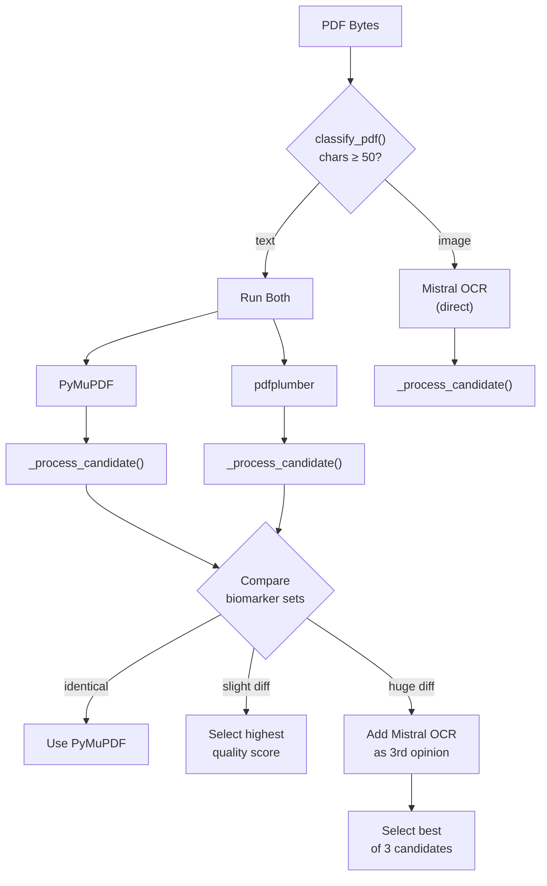
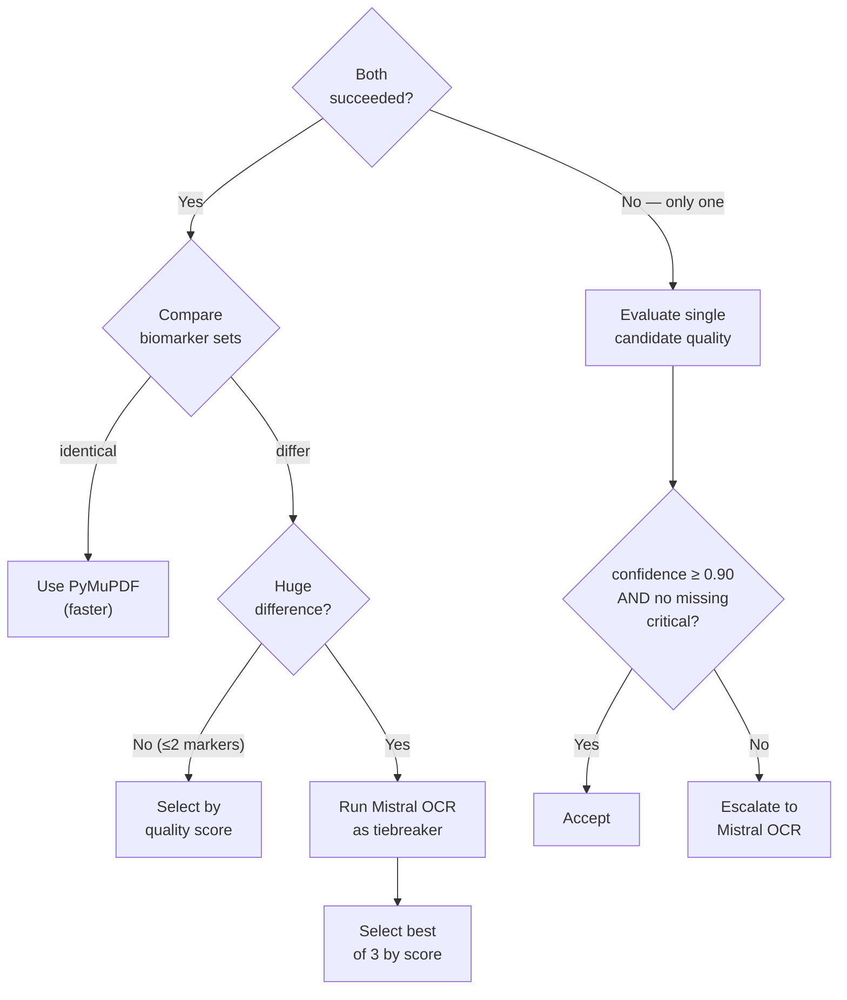

# 13 — Extraction Benchmarks

## Purpose

This document provides a comprehensive technical profile of each PDF extractor in the pipeline, documents the quality-driven orchestration logic that selects among them, and establishes the benchmarking framework for measuring extraction accuracy, latency, and cost. It serves as both a performance reference and a tuning guide for production optimization.

---

## Extractor Profiles

### Overview



### PyMuPDF (`fitz`)

**File:** [pymupdf.py](file:///home/Code/DBT/report-viewer/apps/extraction/app/extractors/pymupdf.py)

| Property | Value |
| -------- | ----- |
| **Role** | Primary extractor — fast-path for text-based PDFs |
| **Library** | `PyMuPDF` (C bindings via `fitz`) |
| **Method** | `page.get_text("text")` per page |
| **Base confidence** | `0.95` |
| **Min text threshold** | 50 characters |
| **Async** | No (synchronous, in-process) |
| **External API** | None |
| **Cost** | Free (local CPU) |

**Strengths:**
- Fastest extractor (~10-50ms for typical lab reports)
- No network latency, no API cost
- Excellent for well-formed, digitally-generated PDFs
- Preserves reading order from PDF structure

**Weaknesses:**
- Cannot extract text from scanned/image PDFs
- May miss data in complex table layouts where text is overlapping or layered
- Returns raw character stream — table cell boundaries are lost

---

### pdfplumber

**File:** [pdfplumber.py](file:///home/Code/DBT/report-viewer/apps/extraction/app/extractors/pdfplumber.py)

| Property | Value |
| -------- | ----- |
| **Role** | Secondary extractor — better at tables and structured layouts |
| **Library** | `pdfplumber` (pure Python, built on `pdfminer.six`) |
| **Method** | `page.extract_text()` + `page.extract_tables()` |
| **Base confidence** | `0.88` |
| **Min text threshold** | 50 characters |
| **Async** | No (synchronous, in-process) |
| **External API** | None |
| **Cost** | Free (local CPU) |

**Strengths:**
- Dedicated table extraction engine — captures tabular biomarker data that PyMuPDF may flatten
- Table rows are converted to `"cell1  cell2  cell3"` plain text lines
- Better at preserving column alignment in multi-column lab reports

**Weaknesses:**
- Slower than PyMuPDF (~2-5x, pure Python vs C bindings)
- Cannot handle scanned/image PDFs
- Table extraction can fail on malformed table boundaries (`extract_tables()` returns empty)

**Table Extraction Flow:**

```python
for page in pdf.pages:
    text = page.extract_text()        # standard text
    tables = page.extract_tables()    # structured tables
    table_text = _tables_to_text(tables)
    combined = text + "\n" + table_text
```

---

### Mistral OCR

**File:** [mistral_ocr.py](file:///home/Code/DBT/report-viewer/apps/extraction/app/extractors/mistral_ocr.py)

| Property | Value |
| -------- | ----- |
| **Role** | Fallback extractor — handles scanned/image-based PDFs |
| **API** | `https://api.mistral.ai/v1/ocr` |
| **Model** | `mistral-ocr-latest` |
| **Base confidence** | `0.75` |
| **Auth** | `MISTRAL_API_KEY` environment variable |
| **Timeout** | 120 seconds |
| **Async** | Yes (`httpx.AsyncClient`) |
| **Cost** | Per-call API pricing |
| **Input** | Base64-encoded PDF in request body |
| **Output** | Per-page markdown text |

**Strengths:**
- Can read scanned documents, photographs of lab reports, and image-based PDFs
- Returns structured markdown which preserves some formatting
- Only extractor capable of handling non-selectable text

**Weaknesses:**
- Highest latency (network round-trip + OCR processing, typically 5-30 seconds)
- Incurs per-call API cost
- Dependent on external service availability
- Lower base confidence (0.75) — OCR inherently introduces noise

---

## Extractor Comparison Matrix

| Dimension | PyMuPDF | pdfplumber | Mistral OCR |
| --------- | ------- | ---------- | ----------- |
| **Speed** | ~10-50ms | ~50-250ms | ~5-30s |
| **Cost** | Free | Free | API-billed |
| **Base confidence** | 0.95 | 0.88 | 0.75 |
| **Text PDFs** | ✅ Excellent | ✅ Good | ✅ Works (overkill) |
| **Table layouts** | ⚠️ Flattened | ✅ Structured | ✅ Markdown |
| **Scanned/image PDFs** | ❌ Cannot | ❌ Cannot | ✅ Primary use case |
| **Dependencies** | C library (`fitz`) | Pure Python | External API |
| **Offline capable** | ✅ | ✅ | ❌ |
| **Concurrency** | Sync | Sync | Async |

---

## Orchestration Logic

**File:** [__init__.py](file:///home/Code/DBT/report-viewer/apps/extraction/app/extractors/__init__.py)

### Phase 1 — PDF Classification

```python
def classify_pdf(pdf_bytes: bytes) -> str:
    total_chars = sum(len(page.get_text("text")) for page in doc)
    return "text" if total_chars >= 50 else "image"
```

- **`text`** → proceed to PyMuPDF + pdfplumber parallel extraction
- **`image`** → route directly to Mistral OCR (skip text extractors entirely)

### Phase 2 — Parallel Extraction (text PDFs only)

Both PyMuPDF and pdfplumber run on the same PDF. Each produces an independent `_process_candidate()` result:

```
_process_candidate(result):
    1. mask_text()           → PHI masking
    2. extract_biomarkers_llm() → LLM parsing
    3. normalize_batch()     → canonical resolution
    4. score_extraction()    → quality scoring
```

> [!IMPORTANT]
> Each candidate triggers its own LLM call. This means text PDFs may consume 2× LLM tokens. This is a deliberate trade-off for accuracy validation — the cost is offset by avoiding incorrect extractions that would require manual correction.

### Phase 3 — Candidate Selection



### "Huge Difference" Definition

A discrepancy between PyMuPDF and pdfplumber is classified as "huge" when **any** of these conditions is true:

| Condition | Example |
| --------- | ------- |
| One extractor found 0 markers, the other found > 0 | PyMuPDF: 0, pdfplumber: 8 |
| Symmetric difference > 2 biomarkers | PyMuPDF found `{A, B, C}`, pdfplumber found `{A, D, E, F}` → diff = `{B, C, D, E, F}` = 5 |
| Discrepancy > 20% of union | diff / union > 0.2 |

### Selection Criteria

When multiple candidates exist, `_select_best()` ranks by:
1. **Quality confidence score** (primary — composite from coverage/structural/critical)
2. **Number of normalized biomarkers** (tiebreaker — richer extraction wins)

```python
best = max(candidates, key=lambda c: (
    c["quality"].confidence_score,
    len(c["normalized_biomarkers"]),
))
```

---

## Quality-Driven Escalation

### Thresholds

| Threshold | Value | Effect |
| --------- | ----- | ------ |
| `CONFIDENCE_ACCEPT_THRESHOLD` | `0.90` | Accept extraction if composite score ≥ 0.90 |
| `CONFIDENCE_ESCALATE_THRESHOLD` | `0.75` | (Defined but not yet used — reserved for tiered escalation) |

### Escalation Triggers

The `should_fallback()` function triggers OCR escalation when:

1. **Low confidence:** `confidence_score < 0.90`
2. **Missing critical markers:** Any marker in a detected panel's `critical` list is absent

```python
def should_fallback(quality: ExtractionQuality) -> bool:
    if quality.confidence_score < 0.90:
        return True
    if quality.missing_critical:
        return True
    return False
```

> [!NOTE]
> This function is only invoked when a single text extractor succeeds (one of PyMuPDF/pdfplumber failed). When both succeed, the comparison logic handles escalation via the "huge difference" path.

---

## End-to-End Pipeline Timing

### Expected Latency Breakdown

| Stage | Typical Duration | Notes |
| ----- | ---------------- | ----- |
| PDF download | 200–500ms | From Supabase Storage |
| PDF classification | <5ms | Single PyMuPDF pass |
| PyMuPDF extraction | 10–50ms | C-native text pull |
| pdfplumber extraction | 50–250ms | Python-based + table parsing |
| PHI masking (×2) | 100–300ms each | Presidio NER + regex per candidate |
| LLM biomarker parse (×2) | 1–3s each | `gpt-4o-mini` structured output |
| Normalization (×2) | <50ms each | In-memory dictionary lookup |
| Quality scoring (×2) | <10ms each | Pure computation |
| Candidate comparison | <1ms | Set operations |
| Mistral OCR (if triggered) | 5–30s | Network + OCR processing |
| Insight generation | 1–3s | `gpt-4o-mini` structured output |
| RAG ingestion | 500ms–2s | Embedding + DB write |
| **Total (text PDF, no OCR)** | **~4–10s** | |
| **Total (text PDF, with OCR tiebreak)** | **~10–35s** | |
| **Total (image PDF, OCR only)** | **~8–35s** | |

### Cost Profile (Per Extraction)

| Component | Text PDF | Text + OCR Tiebreak | Image PDF |
| --------- | -------- | ------------------- | --------- |
| LLM biomarker parse | 2 calls | 3 calls | 1 call |
| LLM insight generation | 1 call | 1 call | 1 call |
| Mistral OCR | 0 calls | 1 call | 1 call |
| RAG embedding | 1 call | 1 call | 1 call |
| **Total LLM calls** | **3** | **5** | **3** |

---

## Diagnostic Data

### Quality Output Structure

Every extraction returns a `quality` object in the response:

```json
{
  "extractor": "pymupdf",
  "markers_found": 18,
  "markers_with_values": 18,
  "markers_with_units": 18,
  "markers_with_ranges": 16,
  "coverage_score": 0.95,
  "structural_score": 0.89,
  "critical_marker_score": 1.0,
  "confidence_score": 0.9145,
  "detected_panels": ["CBC", "Lipid Panel", "Liver", "Kidney"],
  "missing_critical": []
}
```

### API Logs

Each extraction result includes an `api_logs` metadata block containing the raw text and biomarkers from each extractor that was invoked. This enables post-hoc comparison without re-running the pipeline.

```json
{
  "metadata": {
    "api_logs": {
      "pymupdf": {
        "text": "raw extracted text...",
        "biomarkers": [{ "canonical_name": "hemoglobin", ... }]
      },
      "pdfplumber": {
        "text": "raw extracted text...",
        "biomarkers": [{ "canonical_name": "hemoglobin", ... }]
      },
      "mistral_ocr": {
        "text": "OCR markdown...",
        "biomarkers": [{ "canonical_name": "hemoglobin", ... }]
      }
    }
  }
}
```

---

## Benchmarking Framework

### Metrics to Track

| Metric | Definition | Target |
| ------ | ---------- | ------ |
| **Extraction accuracy** | Correctly identified biomarkers / total biomarkers in PDF | ≥ 95% |
| **False positive rate** | Hallucinated biomarkers / total extracted | < 2% |
| **Panel coverage** | Critical markers found / critical markers expected | 100% |
| **Structural completeness** | Markers with all 4 fields / total markers | ≥ 85% |
| **Composite confidence** | Weighted quality score | ≥ 0.90 |
| **OCR escalation rate** | Extractions requiring Mistral OCR / total | < 15% |
| **End-to-end latency** | Upload → COMPLETED status | p50 < 8s, p95 < 20s |

### Recommended Benchmark Dataset

To validate extraction performance, build a test corpus with these categories:

| Category | Description | Expected Behavior |
| -------- | ----------- | ----------------- |
| **Clean digital** | Hospital-generated PDF, selectable text | PyMuPDF succeeds, confidence ≥ 0.90 |
| **Table-heavy** | Multi-column tabular layout | pdfplumber may win on biomarker count |
| **Mixed content** | Text + embedded images/logos | Both text extractors succeed |
| **Scanned report** | Photographed or scanned lab sheet | Classified as `image`, OCR path |
| **Multi-lab format** | Different lab report templates | Tests alias resolution breadth |
| **Minimal panel** | Only 2-3 biomarkers (e.g. single thyroid) | Low coverage but high structural score |
| **Full panel** | 30+ biomarkers across multiple panels | Stress-tests normalization + quality |

### Running a Benchmark

```bash
# 1. Prepare test PDFs in a directory
# 2. For each PDF, call the extraction endpoint
curl -X POST http://localhost:8001/extract \
  -H "Content-Type: application/json" \
  -H "X-Service-Secret: $SECRET" \
  -d '{"file_url": "...", "file_type": "application/pdf", "upload_id": "bench-001"}'

# 3. Collect quality.confidence_score, quality.detected_panels, 
#    quality.missing_critical, method, and normalized_biomarkers count
# 4. Compare against ground-truth biomarker lists
```

---

## Tuning Guide

### Adjustable Parameters

| Parameter | File | Current Value | Effect |
| --------- | ---- | ------------- | ------ |
| `MIN_TEXT_LENGTH` | pymupdf.py, pdfplumber.py | `50` | Chars below this → extractor returns None |
| `CONFIDENCE_ACCEPT_THRESHOLD` | quality.py | `0.90` | Below this → escalate to OCR |
| `CONFIDENCE_ESCALATE_THRESHOLD` | quality.py | `0.75` | Reserved for future tiered escalation |
| `_MIN_PANEL_HITS` | quality.py | `2` | Min markers to detect a panel |
| `_CRITICAL_WEIGHT` | quality.py | `1.0` | Coverage weight for critical markers |
| `_OPTIONAL_WEIGHT` | quality.py | `0.4` | Coverage weight for optional markers |
| Coverage weight | quality.py | `0.45` | In composite formula |
| Structural weight | quality.py | `0.30` | In composite formula |
| Critical weight | quality.py | `0.25` | In composite formula |
| `MAX_INPUT_CHARS` | biomarker.py | `18,000` | LLM input truncation limit |
| OCR timeout | mistral_ocr.py | `120s` | Max wait for Mistral API |

### Common Tuning Scenarios

| Problem | Symptom | Adjustment |
| ------- | ------- | ---------- |
| Good PDFs trigger unnecessary OCR | OCR rate > 30% | Lower `CONFIDENCE_ACCEPT_THRESHOLD` to 0.85 |
| Missing markers from table-heavy PDFs | pdfplumber finds more but PyMuPDF is selected | Already handled — `_select_best()` picks by score |
| False positives from fuzzy matching | Incorrect canonical names | Raise fuzzy threshold in `normalizer.py` (0.75 → 0.80) |
| Slow extractions | p95 > 30s | Disable parallel candidate processing; use PyMuPDF-first with conditional fallback |
| LLM cost too high | 2× LLM calls per text PDF | Switch to single-extractor mode with quality gating |

---

## Related Documents

| Document | Relevance |
| -------- | --------- |
| `04_EXTRACTION_PIPELINE.md` | Full lifecycle from upload to COMPLETED |
| `11_PROMPTS.md` | P-001 biomarker extraction prompt |
| `12_BIOMARKER_NORMALIZATION.md` | Normalization cascade and quality scoring |
| `08_DECISION_LOG.md` | D-007 (parallel extraction), D-011 (OCR escalation), D-012 (weighted coverage) |

---

### Revision History

| Date       | Change |
| ---------- | ------ |
| 2026-07-08 | Initial document — extractor profiles, orchestration logic, and benchmarking framework. |
